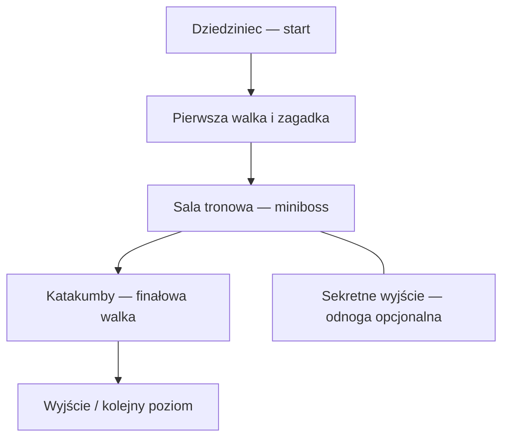

# Shadows of the Forsaken

Przygodowa gra akcji z eksploracją i zagadkami środowiskowymi w mrocznym, upadłym królestwie. Projekt powstaje w Unity i ma **implementować grę oraz poziom opisane w [Shadows of the Forsaken.docx](Shadows%20of%20the%20Forsaken.docx)**.

> **DOCX jest nadrzędną specyfikacją projektu** — obejmuje tekst, referencje graficzne, flow chart i mapę 2D. README opisuje zakres i stan realizacji, ale nie zastępuje dokumentu. W razie rozbieżności obowiązuje DOCX albo późniejsza, wyraźna decyzja właściciela projektu. Prototypy techniczne są etapami realizacji, nie alternatywnym pomysłem na grę.

## Docelowa gra

Zgodnie z sekcjami 1–2 dokumentu gracz eksploruje ruiny miast i zamków, walczy z demonicznymi stworzeniami oraz skażonymi ludźmi i rozwiązuje zagadki środowiskowe. Pierwszy poziom rozgrywa się w ruinach starożytnego, przeklętego zamku pośród mglistych gór.

Kierunek wizualny to gotycka architektura, wszechobecny cień i skąpe światło pochodni oraz księżyca. Referencje z §5 pokazują monumentalne gotyckie budowle, zrujnowane wnętrza, sklepienia, kolumny i kamienne katakumby z sarkofagami. Są materiałem referencyjnym, a nie zrzutami działającej gry.

## Zakres pierwszego poziomu

| Element | Wymaganie wynikające z DOCX | Źródło |
| --- | --- | --- |
| Wejście / dziedziniec | Kilkadziesiąt sekund spokojnej eksploracji, zapoznanie z zamkiem i atmosferą. | §3, §7 |
| Pierwsze zagrożenie | Stopniowe wprowadzenie zagrożenia przez pojedynczego przeciwnika / demona. | §3, §6, §8 |
| Zagadka środowiskowa | Otwieranie bram i tajnych przejść za pomocą starożytnych run lub dźwigni. | §3, §6, §8 |
| Sala tronowa | Główny punkt orientacyjny; zniszczone kolumny i ślady krwi. Tekst opisuje mini-walkę, a oba diagramy wyraźnie wskazują minibossa. | §4, §6–8 |
| Przeklęta biblioteka | Zakazane księgi i mechanizm blokujący ukryte drzwi. | §4 |
| Katakumby | Mroczne podziemne korytarze ze śladami kultu; sekretne przejście i mechanizm. Mapa oznacza sekretną dźwignię. | §4, §7, §8 |
| Finałowa walka | Flow chart umieszcza finałową walkę w etapie katakumb; mapa oznacza oddzielny końcowy obszar jako „Finałowa Walka/Scena”. | §6, §8 |
| Opcjonalny sekret | Flow chart pokazuje odnogę „Sekretne Wyjście”, a mapa „Sekretną Salę (Bonus)”. Ich związek określają rozstrzygnięcia poniżej. | §3, §6, §8 |
| Gotyckie okna / witraże | Światło księżyca podkreślające pozostałości dawnej świetności zamku. | §4 |
| Zakończenie | Wyjście lub przejście do kolejnego poziomu. | §6, §7 |
| Tempo rozgrywki | Około 2–3 minut przy podstawowej eksploracji; opcjonalne sekrety wydłużają rozgrywkę. | §3 |
| Układ i połączenia | Realizacja przebiegu z flow chartu oraz przestrzennego układu mapy 2D, z jawnym rozstrzygnięciem ich niejednoznaczności. | §6, §8 |

### Przebieg według flow chartu (§6)

Poniższy schemat odwzorowuje etapy i połączenia z ilustracji w dokumencie. Rozbicie pierwszej walki i zagadki na konkretne pokoje wynika z mapy, nie z tego uproszczonego diagramu.



Mapa z §8 rozwija układ przestrzenny: start znajduje się na dole, pierwsze starcie powyżej niego, zagadka po lewej, sala tronowa po prawej, katakumby dalej u góry. W górnej części są końcowa walka / scena oraz lewa odnoga do sekretnej sali bonusowej. Połączenia i proporcje przestrzeni należy sprawdzać w oryginalnej ilustracji; schemat Mermaid nie zastępuje mapy.

### Przyjęte rozstrzygnięcia — issue #4

[Decyzje projektowe](docs/design-decisions.md) rozdzielają wymagania DOCX od interpretacji przyjętych do implementacji. Zawierają mapowanie obszarów na siatkę mapy, model sterowania i walki oraz wybór pierwszego targetu: Windows x64. Oryginalny DOCX pozostał bez zmian.

- **Biblioteka:** obowiązkowy łącznik między salą tronową a katakumbami; mechanizm ukrytych drzwi otwiera drogę do podziemi.
- **Sekret:** jedna sala bonusowa z dojściem od katakumb oraz ukrytym skrótem od sali tronowej. Oba połączenia odblokowuje dźwignia w katakumbach, dopiero po otwarciu biblioteki. Skrót jest jawną interpretacją połączenia flow chartu, nie korytarzem narysowanym na mapie. Bonus nie jest wymagany do ukończenia.
- **Finał:** górna komnata należy do katakumb; po walce otwiera się wyjście kończące scenariusz. Bez obowiązkowej cutscenki i bez ładowania nieistniejącego następnego poziomu.

[Kontrakt poziomu w JSON](docs/level-contract.json) zapisuje obszary, połączenia i warunki postępu. Walidator sprawdza osiągalność i brak przedwczesnego ukończenia w modelu, z sekretem i bez niego. JSON pozostaje kontraktem projektowym; [runtime C# dla #10](docs/progression-runtime.md) implementuje te reguły osobno i jest porównywany z nim w testach. **Same testy modelu ani rdzeni C# nie potwierdzają działania sceny w Unity.**

Dokument nie określa również wszystkich parametrów implementacyjnych: klawiszy, statystyk przeciwników, obrażeń, szczegółowych zasad walki czy wymiarów geometrii. Takie decyzje należy oznaczać jako decyzje projektowe / techniczne, a nie dosłowne wymagania DOCX.

## Aktualny stan

Implementacja sceny gry znajduje się w Assets/Scenes/ForsakenCastle.unity. Scena składa poziom zgodny z mapą i zapisanymi decyzjami: wszystkie obowiązkowe obszary, trzy starcia, zagadka run, biblioteka, katakumby, opcjonalna sala i osobny skrót oraz zakończenie. [Opis implementacji i mapowania do DOCX](docs/level-implementation.md) rozdziela wymagania od wybranej skali, balansu i stylizacji.

| Obszar | Stan |
| --- | --- |
| Specyfikacja i kontrakt (#4) | DOCX i jego hash zachowane; decyzje i warunki postępu bez zmian. |
| Runtime postępu (#10), ruch (#6), kamera (#7) | Istniejące rdzenie i GUID-y wykorzystane w scenie gry. |
| Układ zamku (#8) | Geometria, collidery, osobna lewa odnoga zagadki, obowiązkowa biblioteka, dolny skrót do bonusu. Odbiór fizyczny wymaga testów Unity. |
| Walka i obsada (#11–12, #14, #17) | Rzeczywiste ataki, obrażenia, zdrowie, pojedynczy demon, strażnik miniboss i demon finałowy. [Balans i mechanika](docs/combat.md). |
| Interakcje, runy, biblioteka, sekret (#9, #13, #15–16, #19) | E wybiera jeden widoczny cel; sekwencja run, księga, dźwignia i relikt; fizyczne bramy według jednego runtime postępu. [Opis](docs/interaction.md). |
| HUD i restart (#18) | Zdrowie, cel, interakcja, telegraph, wynik i czas; pełny reset sesji po porażce albo zwycięstwie. |
| Oprawa i atmosfera (#20–21) | Stylizowana gotycka geometria, kolumny, krew, księgi, sarkofagi, witraże, księżyc, góry, mgła, pochodnie i syntetyzowany wiatr. Odbiór wizualny pozostaje oddzielny. |
| Dokumentacja i testy rdzeni | Bazowe: Python 73/73 w WSL, postęp 29/29, ruch 36/36, kamera 32/32. Nowe: walka 13/13, runy 5/5; testują rzeczywiste źródła rdzeni. |
| Unity EditMode/PlayMode (#5, #22) | Testy komponentów i całej trasy dodane; przypięty edytor działa. EditMode 113/113; pełny PlayMode i pomiar trasy są w trakcie weryfikacji. |
| Player Windows x64 (#24) | Dodany powtarzalny builder jednej sceny; wykonanie i uruchomienie playera jeszcze wymagają potwierdzenia. |
| Tempo 2–3 minut i odbiór (#23–24) | Niezweryfikowane. Licznik HUD i testy nie zastępują pomiaru przejścia ani ręcznego odbioru. |

Dodano ignorowanie generowanych plików Unity. `Library`, `Logs` i `UserSettings` nie należą do źródeł; usunięcie ich z bieżącego drzewa Git nie usuwa ich ze starej historii.

## Plan realizacji

1. **Fundamenty techniczne:** kontroler gracza, kamera, niezawodne wejście i testy. Zachować istniejące GUID-y skryptów oraz przypiętą wersję Unity.
2. **Blokowy poziom zamku:** dziedziniec, pierwsze starcie, zagadka, sala tronowa, biblioteka, sekretne przejście, katakumby, finał i wyjście. Odwzorować mapę z rozstrzygnięciami zapisanymi w `docs/design-decisions.md`. Geometria zastępcza nie jest finalną oprawą.
3. **Pełny przebieg rozgrywki:** spokojne wejście, pojedynczy pierwszy przeciwnik, zagadka, miniboss, katakumby, finałowa walka i osiągalne zakończenie. Oddzielić opcjonalny sekret od wymaganej ścieżki.
4. **Atmosfera i czytelność:** ruiny, kolumny, księgi, ślady kultu, gotyckie okna, światło księżyca i pochodni, mgła oraz czytelna prezentacja zagrożeń.
5. **Weryfikacja:** testy logiki, testy w Unity i ręczne przejście poziomu. Sprawdzić brak blokad postępu, możliwość ukończenia bez opcjonalnego sekretu oraz dodatkową zawartość sekretnej trasy. Dopiero po pomiarach deklarować osiągnięcie czasu 2–3 minut.

Każda zmiana powinna wskazywać realizowane wymaganie i aktualizować stan implementacji. Nie dodajemy rozbudowanych systemów niezwiązanych ze specyfikacją zamiast realizować opisany poziom. Zasady dla narzędzi i agentów znajdują się w [AGENTS.md](AGENTS.md).

## Uruchomienie projektu

Wersje zapisane w repozytorium:

| Składnik | Wersja |
| --- | --- |
| Unity Editor | `6000.0.24f1` |
| Universal Render Pipeline | `17.0.3` |
| Input System | `1.11.1` |
| Unity Test Framework | `1.4.5` |

Źródła wersji: [ProjectVersion.txt](ProjectSettings/ProjectVersion.txt) i [manifest.json](Packages/manifest.json). Nie aktualizować edytora ani pakietów przypadkowo podczas otwierania projektu.

```sh
git clone https://github.com/lisu188/shadows-of-the-forsaken.git
cd shadows-of-the-forsaken
```

Dodaj katalog repozytorium w Unity Hub, otwórz go we wskazanej wersji edytora i zaczekaj na import zasobów oraz odtworzenie `Library`. Otwórz `Assets/Scenes/ForsakenCastle.unity` i uruchom Play. Geometria jest składana deterministycznie w `Awake`, dlatego przed Play scena pokazuje obiekt właściciela poziomu. `SampleScene` pozostaje bazową fixture testów.

[Instrukcja kontrolera #6](docs/player-movement.md) opisuje podłączenie istniejącego assetu wejścia, W/S, A/D, Spację, sygnały LPM/E, blokowanie sterowania i reset. Po przywróceniu fokusu/pauzy należy puścić używane klawisze przed ponownym sterowaniem. Scena zamku tworzy gracza, wiąże ten kontroler z istniejącym assetem wejścia i dodaje akcję Restart; SampleScene pozostaje fixture bazową.

[Instrukcja kamery #7](docs/camera-follow.md) opisuje przypisanie celu, tag Player, maskę przeszkód, parametry kolizji, `SetTarget` i `SnapToTarget`. Ściany muszą mieć collidery na uwzględnianych warstwach. Przy braku bezpiecznej pozycji kamera czasowo wstrzymuje renderowanie zamiast pokazywać wnętrze geometrii; ograniczenia i wymagany odbiór są opisane w instrukcji.

## Dokumentacja i testy narzędzi

Eksport tekstu specyfikacji, walidatory i testy narzędzi wymagają Git oraz Pythona 3.9 lub nowszego, bez dodatkowych bibliotek:

```sh
python3 tools/export_design.py
python3 tools/validate_level_contract.py
python3 tools/unity_validation.py project
python3 -m unittest discover -s tests -p 'test_*.py' -v
```

Na Windows użyj `python` zamiast `python3`, jeżeli pod tą nazwą dostępny jest interpreter. Eksport tekstowy **nie zawiera ilustracji ani układu graficznego**. Flow chart, mapę i referencje należy sprawdzać w oryginalnym DOCX.

Workflow `Validate` sprawdza dokumentację, kontrakt poziomu, śledzone źródła Unity i narzędzia. **Nie uruchamia silnika Unity, nie kompiluje gry i nie testuje rozgrywki.**

## Testy runtime C# bez edytora

Wymagany jest .NET SDK 8.0. Projekty testów odwołują się do rzeczywistego kodu w `Assets/Progression/Core`, `Assets/Movement/Core`, `Assets/CameraRig/Core`, `Assets/Combat/Core` i `Assets/Puzzles/Core`, nie do kopii lub atrap Unity:

```sh
dotnet test tests/Progression/Progression.Tests.csproj --configuration Release
dotnet test tests/Movement/Movement.Tests.csproj --configuration Release
dotnet test tests/Camera/Camera.Tests.csproj --configuration Release
dotnet test tests/Combat/Combat.Tests.csproj --configuration Release
dotnet test tests/Puzzles/Puzzles.Tests.csproj --configuration Release
```

Workflow `Progression C# tests` kompiluje rdzeń, uruchamia NUnit, sprawdza raport TRX i publikuje go jako artefakt. Test zgodności z JSON porównuje komendy we wszystkich osiągalnych stanach: 29 bez sekretu i 63 z sekretem, łącznie 1472 porównania. Pokrywa również odrzucane komendy. **Nie zastępuje testów komponentu Unity ani fizycznego przejścia poziomu.** Sposób podłączenia komponentu i granice API opisuje [dokument runtime](docs/progression-runtime.md).

Workflow `Movement C# tests` kompiluje produkcyjny rdzeń ruchu jako .NET Standard 2.1 i wykonuje 36 wspólnych przypadków NUnit. Sprawdza także obecność wszystkich prób przy 30/60/120 FPS w raporcie TRX. Testy matematyki ruchu i blokady wejścia nie potwierdzają fizyki CharacterController ani działania Input System w silniku.

Workflow `Camera C# tests` kompiluje produkcyjną matematykę kamery jako .NET Standard 2.1 i wykonuje 32 wspólne przypadki NUnit, w tym próby 30/60/120 FPS. Nie wykonuje zapytań kolizji, renderowania ani automatycznego odnajdywania celu w Unity.

## Testy Unity

Osobny workflow `Unity tests` uruchamia EditMode i PlayMode na Unity 6000.0.24f1, każdy tryb z czystego checkoutu bez cache `Library`. Wymaga skonfigurowanej aktywacji; jej brak kończy etap wstępny błędem `Unity tests NOT RUN`, a nie zaliczeniem testów. Raporty NUnit są sprawdzane pod kątem brakujących, pustych, niepełnych lub pominiętych wyników.

[Instrukcja testów i aktywacji CI](docs/unity-testing.md) zawiera polecenia lokalne dla Windows, zakres 8 przypadków bazowych, lokalizację logów oraz warunki zamknięcia #5. Kod testów jest w `Assets/Tests`. Do bazowych zestawów dodano wspólne testy rdzeni, testy cyklu życia adaptera #10, testy kontrolera #6 i kamery #7. Dopóki nie ma udanych wyników obu trybów i logu importu, odbiór Unity pozostaje niepotwierdzony. Automatyczny build gry pozostaje osobnym zadaniem #24.

## Struktura repozytorium

```text
Assets/                         Sceny, skrypty, zasoby i powiązane pliki .meta
Assets/CameraRig/Core/          Matematyka wygładzania i limitów kamery bez Unity
Assets/Combat/                 Testowalna walka, przeciwnicy i prezentacja
Assets/Level/                  Scena zamku, architektura, HUD, atmosfera i interakcje
Assets/Puzzles/Core/           Sekwencja run bez zależności Unity
Assets/Movement/Core/           Rdzeń ruchu i blokada wejścia bez zależności Unity
Assets/Progression/             Rdzeń postępu bez Unity i adapter MonoBehaviour
Assets/Tests/                   Testy EditMode i PlayMode silnika Unity
Packages/                       Zależności Unity
ProjectSettings/                Współdzielona konfiguracja i wersja edytora
docs/                           Decyzje projektowe, kontrakt poziomu i uruchamianie testów
tools/                          Walidacja dokumentacji, źródeł i wyników; lokalny runner Unity
tests/                          Testy narzędzi Pythona i modelu poziomu, nie testy silnika
tests/Camera/                   Runner NUnit/.NET kompilujący matematykę kamery
tests/Movement/                 Runner NUnit/.NET kompilujący produkcyjny rdzeń ruchu
tests/Progression/              Runner NUnit/.NET kompilujący produkcyjny rdzeń C#
.github/workflows/              Automatyzacja CI
Shadows of the Forsaken.docx     Nadrzędna specyfikacja gry i poziomu
README.md                       Zakres, uruchomienie i aktualny stan
AGENTS.md                       Zasady pracy nad projektem
```

Nie usuwać ani nie regenerować istniejących plików `.meta`; zawarte w nich GUID-y wiążą skrypty i zasoby ze scenami. Oryginalny dokument projektowy i referencje graficzne należy zachować bez nieuzgodnionych zmian.
