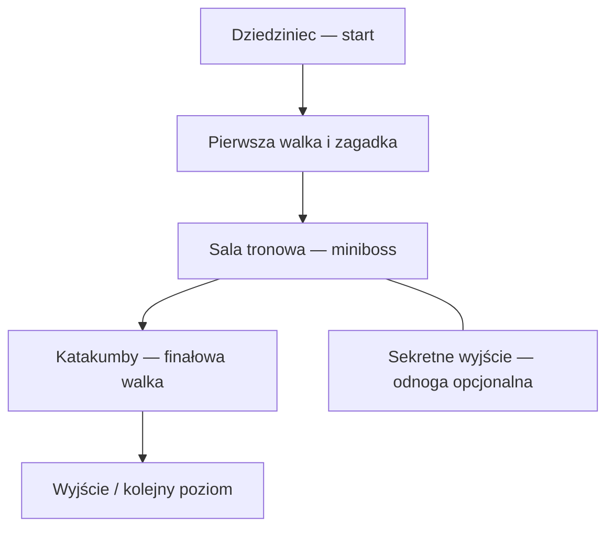

# Shadows of the Forsaken

Przygodowa gra akcji z eksploracją i zagadkami środowiskowymi w mrocznym, upadłym królestwie. Projekt powstaje w Unity i ma **implementować grę oraz poziom opisane w [Shadows of the Forsaken.docx](Shadows%20of%20the%20Forsaken.docx)**.

> **DOCX jest nadrzędną specyfikacją projektu** — obejmuje tekst, referencje graficzne, flow chart i mapę 2D. README opisuje zakres i stan realizacji, ale nie zastępuje dokumentu. W razie rozbieżności obowiązuje DOCX albo późniejsza, wyraźna decyzja właściciela projektu. Prototypy techniczne są etapami realizacji, nie alternatywnym pomysłem na grę.

## Docelowa gra

Zgodnie z sekcjami 1–2 dokumentu gracz eksploruje ruiny miast i zamków, walczy z demonicznymi stworzeniami oraz skażonymi ludźmi i rozwiązuje zagadki środowiskowe. Pierwszy poziom rozgrywa się w ruinach starożytnego, przeklętego zamku pośród mglistych gór.

Kierunek wizualny to gotycka architektura, wszechobecny cień i skąpe światło pochodni oraz księżyca. Referencje z §5 pokazują monumentalne gotyckie budowle, zrujnowane wnętrza, sklepienia, kolumny i kamienne katakumby z sarkofagami. Są materiałem referencyjnym, a nie zrzutami działającej gry.

## Zakres pierwszego poziomu

| Element | Wymaganie wynikające z DOCX | Źródło |
| --- | --- | --- |
| Wejście / dziedziniec | Kilkadziesiąt sekund spokojnej eksploracji, zapoznanie z zamkiem i atmosferą. | §3, §7 |
| Pierwsze zagrożenie | Stopniowe wprowadzenie zagrożenia przez pojedynczego przeciwnika / demona. | §3, §6, §8 |
| Zagadka środowiskowa | Otwieranie bram i tajnych przejść za pomocą starożytnych run lub dźwigni. | §3, §6, §8 |
| Sala tronowa | Główny punkt orientacyjny; zniszczone kolumny i ślady krwi. Tekst opisuje mini-walkę, a oba diagramy wyraźnie wskazują minibossa. | §4, §6–8 |
| Przeklęta biblioteka | Zakazane księgi i mechanizm blokujący ukryte drzwi. | §4 |
| Katakumby | Mroczne podziemne korytarze ze śladami kultu; sekretne przejście i mechanizm. Mapa oznacza sekretną dźwignię. | §4, §7, §8 |
| Finałowa walka | Flow chart umieszcza finałową walkę w etapie katakumb; mapa oznacza oddzielny końcowy obszar jako „Finałowa Walka/Scena”. | §6, §8 |
| Opcjonalny sekret | Flow chart pokazuje odnogę „Sekretne Wyjście”, a mapa „Sekretną Salę (Bonus)”. Ich związek określają rozstrzygnięcia poniżej. | §3, §6, §8 |
| Gotyckie okna / witraże | Światło księżyca podkreślające pozostałości dawnej świetności zamku. | §4 |
| Zakończenie | Wyjście lub przejście do kolejnego poziomu. | §6, §7 |
| Tempo rozgrywki | Około 2–3 minut przy podstawowej eksploracji; opcjonalne sekrety wydłużają rozgrywkę. | §3 |
| Układ i połączenia | Realizacja przebiegu z flow chartu oraz przestrzennego układu mapy 2D, z jawnym rozstrzygnięciem ich niejednoznaczności. | §6, §8 |

### Przebieg według flow chartu (§6)

Poniższy schemat odwzorowuje etapy i połączenia z ilustracji w dokumencie. Rozbicie pierwszej walki i zagadki na konkretne pokoje wynika z mapy, nie z tego uproszczonego diagramu.



Mapa z §8 rozwija układ przestrzenny: start znajduje się na dole, pierwsze starcie powyżej niego, zagadka po lewej, sala tronowa po prawej, katakumby dalej u góry. W górnej części są końcowa walka / scena oraz lewa odnoga do sekretnej sali bonusowej. Połączenia i proporcje przestrzeni należy sprawdzać w oryginalnej ilustracji; schemat Mermaid nie zastępuje mapy.

### Przyjęte rozstrzygnięcia — issue #4

[Decyzje projektowe](docs/design-decisions.md) rozdzielają wymagania DOCX od interpretacji przyjętych do implementacji. Zawierają mapowanie obszarów na siatkę mapy, model sterowania i walki oraz wybór pierwszego targetu: Windows x64. Oryginalny DOCX pozostał bez zmian.

- **Biblioteka:** obowiązkowy łącznik między salą tronową a katakumbami; mechanizm ukrytych drzwi otwiera drogę do podziemi.
- **Sekret:** jedna sala bonusowa z dojściem od katakumb oraz ukrytym skrótem od sali tronowej. Oba połączenia odblokowuje dźwignia w katakumbach, dopiero po otwarciu biblioteki. Skrót jest jawną interpretacją połączenia flow chartu, nie korytarzem narysowanym na mapie. Bonus nie jest wymagany do ukończenia.
- **Finał:** górna komnata należy do katakumb; po walce otwiera się wyjście kończące scenariusz. Bez obowiązkowej cutscenki i bez ładowania nieistniejącego następnego poziomu.

[Kontrakt poziomu w JSON](docs/level-contract.json) zapisuje obszary, połączenia i warunki postępu. Walidator sprawdza osiągalność i brak przedwczesnego ukończenia w modelu, z sekretem i bez niego. JSON pozostaje kontraktem projektowym; [runtime C# dla #10](docs/progression-runtime.md) implementuje te reguły osobno i jest porównywany z nim w testach. **Testy modelu i C# są oddzielne od testów sceny w Unity.**

Dokument nie określa również wszystkich parametrów implementacyjnych: klawiszy, statystyk przeciwników, obrażeń, szczegółowych zasad walki czy wymiarów geometrii. Takie decyzje należy oznaczać jako decyzje projektowe / techniczne, a nie dosłowne wymagania DOCX.

## Aktualny stan

Kod i jawny builder sceny `Assets/Scenes/ForsakenCastle.unity` łączą pełną trasę zamku: spokojny dziedziniec, trzy odrębne starcia, runiczną dźwignię, mechanizm biblioteki, opcjonalny relikt i wyjście. [Opis pełnej trasy](docs/full-castle-route.md) podaje sterowanie, parametry AI, połączenia, restart i granice dowodów. Zachowano scenę bazową `SampleScene` oraz oddzielne demonstracje mechanik.

| Obszar | Stan |
| --- | --- |
| Specyfikacja i kontrakt (#4) | DOCX i jego hash zachowane; główna trasa oraz opcjonalność sekretu pozostają zgodne z kontraktem. Późniejsze decyzje opisują wydłużone podejście i proste mechanizmy. |
| Postęp i integracja sceny (#10, #18) | Jeden kontroler postępu, przestrzenne triggery pokoi, sesja Running/Defeated/Completed/Resetting, terminalny restart i odtwarzanie świata. |
| Ruch i kamera (#6–7) | Istniejące sterowanie i ochrona kamery przed kolizjami; dodano R oraz niezależną blokadę sesji i ukrywanie własnego modelu przy zbliżeniu kamery. |
| Interakcje i bramy (#9, #13, #15–16, #19) | E uruchamia oznaczoną dźwignię, księgę, dźwignię sekretu i relikt. Uszkodzony mechanizm daje nieszkodliwy komunikat. Bramy synchronizują collider, panel i blokadę nawigacji. |
| Walka i starcia (#11–12, #14, #17) | Wspólne zdrowie i melee obsługują jednego demona, wytrzymalszego strażnika i szybszego demona finałowego. AI ma ograniczoną arenę, nawigację, kontrolę przeszkód i zachowuje tokeny oczekującego zaliczenia śmierci. |
| Geometria zamku (#8) | Zachowano dziewięć obszarów, zejście biblioteki i osobny dolny skrót. Podejście wydłużono do 100 m; brak przejścia przez ścianę między zagadką a tronem. |
| HUD i zakończenie (#18) | Zdrowie, cel, interakcja, komunikaty, oddzielna porażka i ukończenie. R/przycisk resetuje poziom tylko po stanie terminalnym; sekret nie jest wymagany do wyjścia. |
| Walidacja rdzeni | 160 testów .NET zaliczonych, w tym 46 reguł walki i starć. Te testy nie uruchamiają MonoBehaviour ani nawigacji. |
| Walidacja integracji Unity (#22) | Zaliczono 169 EditMode i 162 PlayMode (ostatni zestaw z wyłączonym audio); PlayMode obejmuje realne komponenty, oba pełne przejścia, trzy porażki/restarty i zamknięte bramy. Końcowy wynik i zachowane nieudane próby opisuje [raport](docs/validation/full-castle-route-2026-09-30.md). |
| Windows player i ręczny odbiór (#23–24) | Zbudowano i uruchomiono Windows x64. Pilot dotarł do walki; pełne pomiary standalone są zablokowane przez zablokowany pulpit Windows. Ręczny odbiór pozostaje otwarty. |
| Finalna oprawa i 2–3 minuty (#20–21, #23) | Wciąż wymagają odbioru; blockout i testy automatyczne nie zatwierdzają jakości wizualnej ani tempa. |
| Aktywacja Unity w CI (#5) | Brak sekretów GitHub Actions nadal blokuje testy silnika w CI; lokalna aktywacja i wyniki .NET nie usuwają tego ograniczenia. |

Historyczny [raport blockoutu](docs/validation/unity-castle-2026-09-30.md) zawiera 105 EditMode i 68 PlayMode, a [raport wspólnych mechanik i rzeczywistych obrazów](docs/validation/shared-gameplay-2026-09-30.md) — 145 .NET, 153 EditMode, 109 PlayMode oraz 82 Python. Te wyniki opisują wcześniejsze rewizje i nie są deklaracją zaliczenia nowych starć, pełnej trasy ani player builda.

Dodano ignorowanie generowanych plików Unity. `Library`, `Logs` i `UserSettings` nie należą do źródeł; usunięcie ich z bieżącego drzewa Git nie usuwa ich ze starej historii.

## Plan realizacji

1. **Fundamenty techniczne:** kontroler gracza, kamera, niezawodne wejście i testy. Zachować istniejące GUID-y skryptów oraz przypiętą wersję Unity.
2. **Blokowy poziom zamku:** dziedziniec, pierwsze starcie, zagadka, sala tronowa, biblioteka, sekretne przejście, katakumby, finał i wyjście. Odwzorować mapę z rozstrzygnięciami zapisanymi w `docs/design-decisions.md`. Geometria zastępcza nie jest finalną oprawą.
3. **Pełny przebieg rozgrywki:** spokojne wejście, pojedynczy pierwszy przeciwnik, zagadka, miniboss, katakumby, finałowa walka i osiągalne zakończenie. Oddzielić opcjonalny sekret od wymaganej ścieżki.
4. **Atmosfera i czytelność:** ruiny, kolumny, księgi, ślady kultu, gotyckie okna, światło księżyca i pochodni, mgła oraz czytelna prezentacja zagrożeń.
5. **Weryfikacja:** testy logiki, testy w Unity i ręczne przejście poziomu. Sprawdzić brak blokad postępu, możliwość ukończenia bez opcjonalnego sekretu oraz dodatkową zawartość sekretnej trasy. Dopiero po pomiarach deklarować osiągnięcie czasu 2–3 minut.

Każda zmiana powinna wskazywać realizowane wymaganie i aktualizować stan implementacji. Nie dodajemy rozbudowanych systemów niezwiązanych ze specyfikacją zamiast realizować opisany poziom. Zasady dla narzędzi i agentów znajdują się w [AGENTS.md](AGENTS.md).

## Uruchomienie projektu

Wersje zapisane w repozytorium:

| Składnik | Wersja |
| --- | --- |
| Unity Editor | `6000.6.3f1` |
| Universal Render Pipeline | `17.6.0` |
| Input System | `1.20.0` |
| AI Navigation | `2.0.14` |
| Unity UI | `2.6.0` |
| Unity Test Framework | `1.8.0` |

Źródła wersji: [ProjectVersion.txt](ProjectSettings/ProjectVersion.txt) i [manifest.json](Packages/manifest.json). Nie aktualizować edytora ani pakietów przypadkowo podczas otwierania projektu.

Na polecenie właściciela zapisano aktualizację do Unity `6000.6.3f1` oraz pakietów z manifestu i lockfile; dostosowano przypięcia walidatora, testu wersji i CI. Import, kompilację oraz testy EditMode/PlayMode potwierdzono lokalnie na Windows 2026-09-30. Ta walidacja nie obejmuje player builda ani ręcznego odbioru gry.

```sh
git clone https://github.com/lisu188/shadows-of-the-forsaken.git
cd shadows-of-the-forsaken
```

Dodaj katalog repozytorium w Unity Hub, otwórz go we wskazanej wersji edytora i zaczekaj na import zasobów oraz odtworzenie `Library`. Otwórz `Assets/Scenes/ForsakenCastle.unity` i włącz Play: W/S porusza, A/D obraca, Spacja skacze, LPM atakuje, E używa mechanizmu. R lub przycisk ekranowy rozpoczyna nową sesję po śmierci albo ukończeniu. Instrukcja trasy i jawnego autorowania jest w [opisie integracji](docs/full-castle-route.md). `SampleScene` pozostaje drugą włączoną sceną dla dotychczasowych testów bazowych. Przed dużym importem obowiązuje limit miejsca na dysku z instrukcji projektu.

[Instrukcja kontrolera #6](docs/player-movement.md) opisuje podłączenie istniejącego assetu wejścia, W/S, A/D, Spację, sygnały LPM/E, blokowanie sterowania i reset. Po przywróceniu fokusu/pauzy należy puścić używane klawisze przed ponownym sterowaniem. Gracz i geometria zamku są zapisane w ForsakenCastle; odbiór sceny w Unity pozostaje częścią #8.

[Instrukcja kamery #7](docs/camera-follow.md) opisuje przypisanie celu, tag Player, maskę przeszkód, parametry kolizji, `SetTarget` i `SnapToTarget`. Ściany muszą mieć collidery na uwzględnianych warstwach. Przy braku bezpiecznej pozycji kamera czasowo wstrzymuje renderowanie zamiast pokazywać wnętrze geometrii; ograniczenia i wymagany odbiór są opisane w instrukcji.

Wspólne mechaniki można sprawdzić w zapisanych scenach [InteractionDemo](Assets/Interactions/Demo/InteractionDemo.unity) (E: dźwignia i brama) oraz [CombatDemo](Assets/Combat/Demo/CombatDemo.unity) (LPM: atak na cel). [Instrukcja interakcji](docs/interactions.md) i [instrukcja walki](docs/combat.md) opisują podłączenie i parametry. Są to oddzielne sceny testowe poza Build Settings. Te same komponenty są używane przez integrację pełnej trasy; przygotowane warunki demonstracji nie są dowodem ukończenia zamku.

## Dokumentacja i testy narzędzi

Eksport tekstu specyfikacji, walidatory i testy narzędzi wymagają Git oraz Pythona 3.9 lub nowszego, bez dodatkowych bibliotek:

```sh
python3 tools/export_design.py
python3 tools/validate_level_contract.py
python3 tools/unity_validation.py project
python3 -m unittest discover -s tests -p 'test_*.py' -v
```

Na Windows użyj `python` zamiast `python3`, jeżeli pod tą nazwą dostępny jest interpreter. Eksport tekstowy **nie zawiera ilustracji ani układu graficznego**. Flow chart, mapę i referencje należy sprawdzać w oryginalnym DOCX.

Workflow `Validate` sprawdza dokumentację, kontrakt poziomu, śledzone źródła Unity i narzędzia. **Nie uruchamia silnika Unity, nie kompiluje gry i nie testuje rozgrywki.**

## Testy runtime C# bez edytora

Wymagany jest .NET SDK 8.0. Projekty testów odwołują się do rzeczywistego kodu rdzeni w `Assets`, nie do kopii lub atrap Unity:

```sh
dotnet test tests/Progression/Progression.Tests.csproj --configuration Release
dotnet test tests/Movement/Movement.Tests.csproj --configuration Release
dotnet test tests/Camera/Camera.Tests.csproj --configuration Release
dotnet test tests/Interactions/Interactions.Tests.csproj --configuration Release
dotnet test tests/Combat/Combat.Tests.csproj --configuration Release
```

Workflow `Progression C# tests` kompiluje rdzeń, uruchamia NUnit, sprawdza raport TRX i publikuje go jako artefakt. Test zgodności z JSON porównuje komendy we wszystkich osiągalnych stanach: 29 bez sekretu i 63 z sekretem, łącznie 1472 porównania. Pokrywa również odrzucane komendy. **Nie zastępuje testów komponentu Unity ani fizycznego przejścia poziomu.** Sposób podłączenia komponentu i granice API opisuje [dokument runtime](docs/progression-runtime.md).

Workflow `Movement C# tests` kompiluje produkcyjny rdzeń ruchu jako .NET Standard 2.1 i wykonuje 36 wspólnych przypadków NUnit. Sprawdza także obecność wszystkich prób przy 30/60/120 FPS w raporcie TRX. Testy matematyki ruchu i blokady wejścia nie potwierdzają fizyki CharacterController ani działania Input System w silniku.

Workflow `Camera C# tests` kompiluje produkcyjną matematykę kamery jako .NET Standard 2.1 i wykonuje 32 wspólne przypadki NUnit, w tym próby 30/60/120 FPS. Nie wykonuje zapytań kolizji, renderowania ani automatycznego odnajdywania celu w Unity.

Workflow `Shared gameplay C# tests` kompiluje produkcyjne rdzenie interakcji i walki. Wymaga niepustych, kompletnie zaliczonych raportów TRX; zestaw zawiera 17 przypadków interakcji oraz 46 walki i cyklu życia starć. Raycasty, fizyczne bramy, CharacterController i wejście są weryfikowane osobno w PlayMode.

## Testy Unity

Osobny workflow `Unity tests` uruchamia EditMode i PlayMode na Unity 6000.6.3f1, każdy tryb z czystego checkoutu bez cache `Library`. Wymaga skonfigurowanej aktywacji; jej brak kończy etap wstępny błędem `Unity tests NOT RUN`, a nie zaliczeniem testów. Raporty NUnit są sprawdzane pod kątem brakujących, pustych, niepełnych lub pominiętych wyników.

[Instrukcja testów i aktywacji CI](docs/unity-testing.md) zawiera polecenia lokalne dla Windows, zakres 8 przypadków bazowych, lokalizację logów oraz warunki zamknięcia #5. Kod testów jest w `Assets/Tests`. Do bazowych zestawów dodano testy rdzeni, cyklu życia, kontrolera, kamery, geometrii, interakcji, walki i demonstracji, a następnie regresje AI/nawigacji, sesji, HUD oraz pełnej trasy zamku. Walidator wymaga wykonania nowych regresji, a nie tylko bazowych przypadków. [Raport blockoutu](docs/validation/unity-castle-2026-09-30.md) zachowuje wyniki 105/105 i 68/68 oraz czysty import; [raport wspólnych mechanik](docs/validation/shared-gameplay-2026-09-30.md) opisuje walidację połączonego zestawu po rebase. Aktywacja CI, ręczny odbiór i automatyczny build gry (#24) pozostają osobnymi zadaniami.

## Struktura repozytorium

```text
Assets/                         Sceny, skrypty, zasoby i powiązane pliki .meta
Assets/CameraRig/Core/          Matematyka wygładzania i limitów kamery bez Unity
Assets/Combat/                  Zdrowie, atak, reguły tożsamości starć i arena testowa
Assets/Encounters/              AI, nawigacja i zaliczanie trzech starć
Assets/LevelSession/            Sesja, obszary, HUD i pełny restart
Assets/Interactions/            Mechanizmy, fizyczne bramy, rdzeń i scena testowa
Assets/Movement/Core/           Rdzeń ruchu i blokada wejścia bez zależności Unity
Assets/Progression/             Rdzeń postępu bez Unity i adapter MonoBehaviour
Assets/Tests/                   Testy EditMode i PlayMode silnika Unity
Packages/                       Zależności Unity
ProjectSettings/                Współdzielona konfiguracja i wersja edytora
docs/                           Decyzje projektowe, kontrakt poziomu i uruchamianie testów
tools/                          Walidacja dokumentacji, źródeł i wyników; lokalny runner Unity
tests/                          Testy narzędzi Pythona i modelu poziomu, nie testy silnika
tests/Camera/                   Runner NUnit/.NET kompilujący matematykę kamery
tests/Combat/                   Runner NUnit/.NET kompilujący rdzeń walki
tests/Interactions/             Runner NUnit/.NET kompilujący reguły interakcji
tests/Movement/                 Runner NUnit/.NET kompilujący produkcyjny rdzeń ruchu
tests/Progression/              Runner NUnit/.NET kompilujący produkcyjny rdzeń C#
.github/workflows/              Automatyzacja CI
Shadows of the Forsaken.docx     Nadrzędna specyfikacja gry i poziomu
README.md                       Zakres, uruchomienie i aktualny stan
AGENTS.md                       Zasady pracy nad projektem
```

Nie usuwać ani nie regenerować istniejących plików `.meta`; zawarte w nich GUID-y wiążą skrypty i zasoby ze scenami. Oryginalny dokument projektowy i referencje graficzne należy zachować bez nieuzgodnionych zmian.
