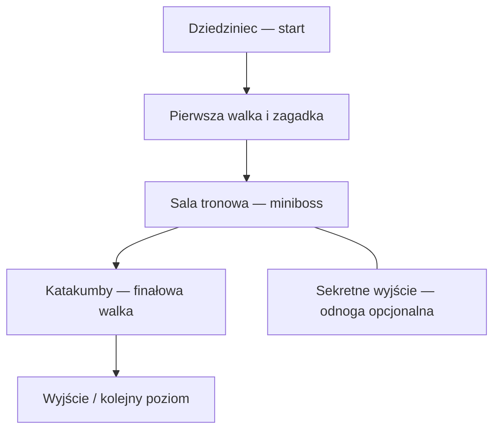

# Shadows of the Forsaken

Przygodowa gra akcji z eksploracją i zagadkami środowiskowymi w mrocznym, upadłym królestwie. Projekt powstaje w Unity i ma **implementować grę oraz poziom opisane w [Shadows of the Forsaken.docx](Shadows%20of%20the%20Forsaken.docx)**.

> **DOCX jest nadrzędną specyfikacją projektu** — obejmuje tekst, referencje graficzne, flow chart i mapę 2D. README opisuje zakres i stan realizacji, ale nie zastępuje dokumentu. W razie rozbieżności obowiązuje DOCX albo późniejsza, wyraźna decyzja właściciela projektu. Prototypy techniczne są etapami realizacji, nie alternatywnym pomysłem na grę.

## Docelowa gra

Zgodnie z sekcjami 1–2 dokumentu gracz eksploruje ruiny miast i zamków, walczy z demonicznymi stworzeniami oraz skażonymi ludźmi i rozwiązuje zagadki środowiskowe. Pierwszy poziom rozgrywa się w ruinach starożytnego, przeklętego zamku pośród mglistych gór.

Kierunek wizualny to gotycka architektura, wszechobecny cień i skąpe światło pochodni oraz księżyca. Referencje z §5 pokazują monumentalne gotyckie budowle, zrujnowane wnętrza, sklepienia, kolumny i kamienne katakumby z sarkofagami. Są materiałem referencyjnym, a nie zrzutami działającej gry.

## Zakres pierwszego poziomu

| Element | Wymaganie wynikające z DOCX | Źródło |
| --- | --- | --- |
| Wejście / dziedziniec | Kilkadziesiąt sekund spokojnej eksploracji, zapoznanie z zamkiem i atmosferą. | §3, §7 |
| Pierwsze zagrożenie | Stopniowe wprowadzenie zagrożenia przez pojedynczego przeciwnika / demona. | §3, §6, §8 |
| Zagadka środowiskowa | Otwieranie bram i tajnych przejść za pomocą starożytnych run lub dźwigni. | §3, §6, §8 |
| Sala tronowa | Główny punkt orientacyjny; zniszczone kolumny i ślady krwi. Tekst opisuje mini-walkę, a oba diagramy wyraźnie wskazują minibossa. | §4, §6–8 |
| Przeklęta biblioteka | Zakazane księgi i mechanizm blokujący ukryte drzwi. | §4 |
| Katakumby | Mroczne podziemne korytarze ze śladami kultu; sekretne przejście i mechanizm. Mapa oznacza sekretną dźwignię. | §4, §7, §8 |
| Finałowa walka | Flow chart umieszcza finałową walkkę w etapie katakumb; mapa oznacza oddzielny końcowy obszar jako „Finałowa Walka/Scena”. | §6, §8 |
| Opcjonalny sekret | Flow chart pokazuje odnogę „Sekretne Wyjście”, a mapa „Sekretną Salę (Bonus)”. Ich związek określają rozstrzygnięcia poniżej. | §3, §6, §8 |
| Gotyckie okna / witraże | Światło księżyca podkreślające pozostałości dawnej świetności zamku. | §4 |
| Zakończenie | Wyjście lub przejście do kolejnego poziomu. | §6, §7 |
| Tempo rozgrywki | Około 2–3 minut przy podstawowej eksploracji; opcjonalne sekrety wydłużają rozgrywkę. | §3 |
| Układ i połączenia | Realizacja przebiegu z flow chartu oraz przestrzennego układu mapy 2D, z jawnym rozstrzygnięciem ich niejednoznaczności. | §6, §8 |

### Przebieg według flow chartu (§6)

Poniższy schemat odwzorowuje etapy i połączenia z ilustracji w dokumencie. Rozbicie pierwszej walki i zagadki na konkretne pokoje wynika z mapy, nie z tego uproszczonego diagramu.



Mapa z §8 rozwija układ przestrzenny: start znajduje się na dole, pierwsze starcie powyżej niego, zagadka po lewej, sala tronowa po prawej, katakumby dalej u góry. W górnej części są końcowa walka / scena oraz lewa odnoga do sekretnej sali bonusowej. Połączenia i proporcje przestrzeni należy sprawdzać w oryginalnej ilustracji; schemat Mermaid nie zastępuje mapy.

### Przyjęte rozstrzygnięcia — issue #4

[Decyzje projektowe](docs/design-decisions.md) rozdzielają wymagania DOCX od interpretacji przyjętych do implementacji. Zawierają mapowanie obszarów na siatkę mapy, model sterowania i walki oraz wybór pierwszego targetu: Windows x64. Oryginalny DOCX pozostał bez zmian.

- **Biblioteka:** obowiązkowy łącznik między salą tronową a katakumbami; mechanizm ukrytych drzwi otwiera drogę do podziemi.
- **Sekret:** jedna sala bonusowa z dojściem od katakumb oraz ukrytym skrótem od sali tronowej. Oba połączenia odblokowuje dźwignia w katakumbach, dopiero po otwarciu biblioteki. Skrót jest jawną interpretacją połączenia flow chartu, nie korytarzem narysowanym na mapie. Bonus nie jest wymagany do ukończenia.
- **Finał:** górna komnata należy do katakumb; po walce otwiera się wyjście kończące scenariusz. Bez obowiązkowej cutscenki i bez ładowania nieistniejącego następnego poziomu.

[Kontrakt poziomu w JSON](docs/level-contract.json) zapisuje obszary, połączenia i warunki postępu. Walidator sprawdza osiągalność i brak przedwczesnego ukończenia w modelu, z sekretem i bez niego. **Nie jest to jeszcze logika działająca w Unity ani implementacja issue #10.**

Dokument nie określa również wszystkich parametrów implementacyjnych: klawiszy, statystyk przeciwników, obrażeń, szczegółowych zasad walki czy wymiarów geometrii. Takie decyzje należy oznaczać jako decyzje projektowe / techniczne, a nie dosłowne wymagania DOCX.

## Aktualny stan

Repozytorium jest na początkowym etapie. Zawiera projekt Unity, scenę szablonową `Assets/Scenes/SampleScene.unity`, podstawowe skrypty `PlayerMovement` i `CameraFollow`, konfigurację Input System oraz zasoby nocnego nieba. Sama obecność skryptów i zasobów **nie oznacza**, że opisany w dokumencie poziom jest grywalny.

| Obszar | Stan |
| --- | --- |
| Specyfikacja, README i zasady pracy | Opisane; DOCX zachowany jako źródło wymagań. |
| Decyzje i kontrakt pierwszego poziomu (#4) | Zapisane; automatycznie sprawdzane osiągalność, warunki bram, opcjonalność sekretu i niezmienność DOCX. |
| Projekt Unity, podstawowe skrypty i zasoby nieba | Istnieją w repozytorium; nie stanowią kompletnego poziomu. |
| Dziedziniec, sala tronowa, biblioteka i katakumby | Do zbudowania jako spójny poziom zgodny z dokumentem. |
| Pierwsze starcie, miniboss i finałowa walka | Do zaimplementowania. |
| Runy / dźwignie, ukryte drzwi i sekrety | Do zaimplementowania. |
| Wyjście / zakończenie poziomu | Do zaimplementowania. |
| Docelowa oprawa i czas 2–3 minut | Niezweryfikowane; wymagają realizacji i testów rozgrywki. |
| Walidacja dokumentacji i źródeł | Eksport DOCX, odnośniki README, kontrakt poziomu, integralność `.meta`/GUID i testy narzędzi w GitHub Actions. |
| Testy bazowe Unity (#5) | Dodano 6 przypadków EditMode i 2 PlayMode oraz osobny workflow. Pierwszy run zablokowany brakiem konfiguracji aktywacji; nie potwierdzono importu ani kompilacji. |
| Build playera i testy ręczne | Nie zostały wykonane; testy narzędzi nie zastępują odbioru gry. |

Dodano ignorowanie generowanych plików Unity. `Library`, `Logs` i `UserSettings` nie należą do źródeł; usunięcie ich z bieżącego drzewa Git nie usuwa ich ze starej historii.

## Plan realizacji

1. **Fundamenty techniczne:** kontroler gracza, kamera, niezawodne wejście i testy. Zachować istniejące GUID-y skryptów oraz przypiętą wersję Unity.
2. **Blokowy poziom zamku:** dziedziniec, pierwsze starcie, zagadka, sala tronowa, biblioteka, sekretne przejście, katakumby, finał i wyjście. Odwzorować mapę z rozstrzygnięciami zapisanymi w `docs/design-decisions.md`. Geometria zastępcza nie jest finalną oprawą.
3. **Pełny przebieg rozgrywki:** spokojne wejście, pojedynczy pierwszy przeciwnik, zagadka, miniboss, katakumby, finałowa walka i osiągalne zakończenie. Oddzielić opcjonalny sekret od wymaganej ścieżki.
4. **Atmosfera i czytelność:** ruiny, kolumny, księgi, ślady kultu, gotyckie okna, światło księżyca i pochodni, mgła oraz czytelna prezentacja zagrożeń.
5. **Weryfikacja:** testy logiki, testy w Unity i ręczne przejście poziomu. Sprawdzić brak blokad postępu, możliwość ukończenia bez opcjonalnego sekretu oraz dodatkową zawartość sekretnej trasy. Dopiero po pomiarach deklarować osiągnięcie czasu 2–3 minut.

Każda zmiana powinna wskazywać realizowane wymaganie i aktualizować stan implementacji. Nie dodajemy rozbudowanych systemów niezwiązanych ze specyfikacją zamiast realizować opisany poziom. Zasady dla narzędzi i agentów znajdują się w [AGENTS.md](AGENTS.md).

## Uruchomienie projektu

Wersje zapisane w repozytorium:

| Składnik | Wersja |
| --- | --- |
| Unity Editor | `6000.0.24f1` |
| Universal Render Pipeline | `17.0.3` |
| Input System | `1.11.1` |
| Unity Test Framework | `1.4.5` |

Źródła wersji: [ProjectVersion.txt](ProjectSettings/ProjectVersion.txt) i [manifest.json](Packages/manifest.json). Nie aktualizować edytora ani pakietów przypadkowo podczas otwierania projektu.

```sh
git clone https://github.com/lisu188/shadows-of-the-forsaken.git
cd shadows-of-the-forsaken
```

Dodaj katalog repozytorium w Unity Hub, otwórz go we wskazanej wersji edytora i zaczekaj na import zasobów oraz odtworzenie `Library`. Otwórz `Assets/Scenes/SampleScene.unity`. To obecnie scena bazowa, a nie gotowy poziom z dokumentu.

## Dokumentacja i testy narzędzi

Eksport tekstu specyfikacji, walidatory i testy narzędzi wymagają Git oraz Pythona 3.9 lub nowszego, bez dodatkowych bibliotek:

```sh
python3 tools/export_design.py
python3 tools/validate_level_contract.py
python3 tools/unity_validation.py project
python3 -m unittest discover -s tests -p 'test_*.py' -v
```

Na Windows użyj `python` zamiast `python3`, jeżeli pod tą nazwą dostępny jest interpreter. Eksport tekstowy **nie zawiera ilustracji ani układu graficznego**. Flow chart, mapę i referencje należy sprawdzać w oryginalnym DOCX.

Workflow `Validate` sprawdza dokumentację, kontrakt poziomu, śledzone źródła Unity i narzędzia. **Nie uruchamia silnika Unity, nie kompiluje gry i nie testuje rozgrywki.**

## Testy Unity

Osobny workflow `Unity tests` uruchamia EditMode i PlayMode na Unity 6000.0.24f1, każdy tryb z czystego checkoutu bez cache `Library`. Wymaga skonfigurowanej aktywacji; jej brak kończy etap wstępny błędem `Unity tests NOT RUN`, a nie zaliczeniem testów. Raporty NUnit są sprawdzane pod kątem brakujących, pustych, niepełnych lub pominiętych wyników.

[Instrukcja testów i aktywacji CI](docs/unity-testing.md) zawiera polecenia lokalne dla Windows, zakres 8 przypadków bazowych, lokalizację logów oraz warunki zamknięcia #5. Kod testów jest w `Assets/Tests`. Dopóki nie ma udanych wyników obu trybów i logu importu, #5 pozostaje otwarte. Automatyczny build gry pozostaje osobnym zadaniem #24.

## Struktura repozytorium

```text
Assets/                         Sceny, skrypty, zasoby i powiązane pliki .meta
Assets/Tests/                   Testy EditMode i PlayMode silnika Unity
Packages/                       Zależności Unity
ProjectSettings/                Współdzielona konfiguracja i wersja edytora
docs/                           Decyzje projektowe, kontrakt poziomu i uruchamianie testów
tools/                          Walidacja dokumentacji, źródeł i wyników; lokalny runner Unity
tests/                          Testy narzędzi Pythona i modelu poziomu, nie testy silnika
.github/workflows/              Automatyzacja CI
Shadows of the Forsaken.docx     Nadrzędna specyfikacja gry i poziomu
README.md                       Zakres, uruchomienie i aktualny stan
AGENTS.md                       Zasady pracy nad projektem
```

Nie usuwać ani nie regenerować istniejących plików `.meta`; zawarte w nich GUID-y wiążą skrypty i zasoby ze scenami. Oryginalny dokument projektowy i referencje graficzne należy zachować bez nieuzgodnionych zmian.
