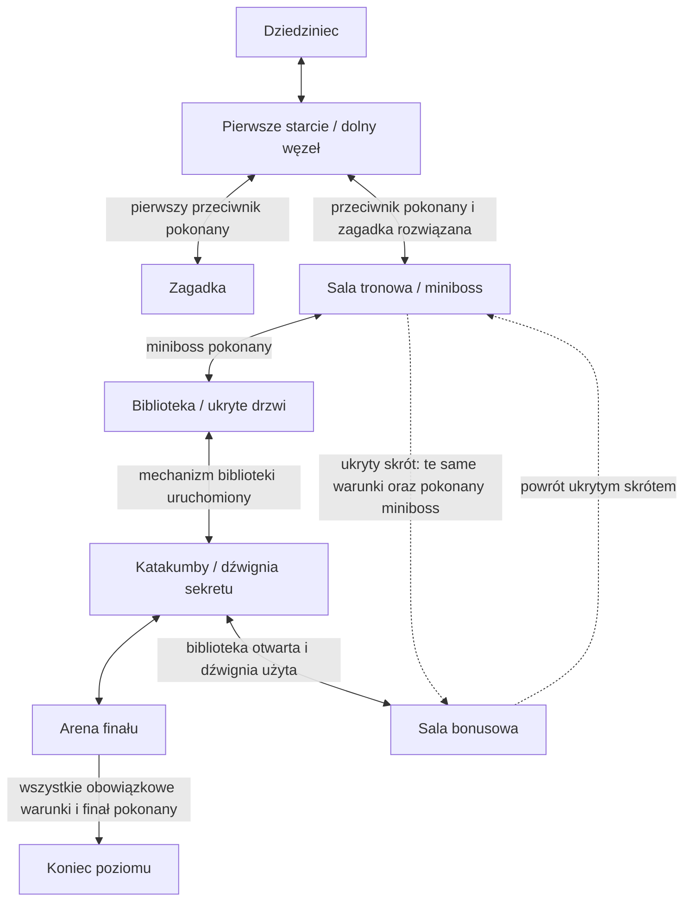

# Decyzje pierwszego poziomu — issue #4

Status: przyjęte do implementacji w ramach polecenia właściciela: „wybierz jedno issue i zaimplementuj i zmerguj”. Jest to zapis decyzji wykonawczych w ramach tego upoważnienia, nie deklaracja odrębnego review właściciela. Późniejsza decyzja właściciela może je zmienić.

Źródło: [Shadows of the Forsaken.docx](../Shadows%20of%20the%20Forsaken.docx), blob Git `8c5b63bdf8f054a60b024407641921caa8055e75`. Sprawdzono tekst oraz ilustracje §6 i §8; dokumentu ani jego grafik nie zmieniono. DOCX nadal jest nadrzędny. Poniższe rozstrzygnięcia uzupełniają niejednoznaczności, nie są cytatami z dokumentu.

## Wymaganie → decyzja → odbiór

| Źródło | Wymaganie | Decyzja implementacyjna | Kryterium odbioru / zadanie |
| --- | --- | --- | --- |
| §4, §7–8 | Biblioteka z księgami i ukrytymi drzwiami; brak osobnej etykiety na mapie | Biblioteka zajmuje istniejący łącznik między salą tronową a katakumbami. Jej mechanizm otwiera obowiązkowe przejście do podziemi. | Każde zwykłe ukończenie zawiera `library_opened`; fizyczny obszar i drzwi: #8, #15. |
| §3, §6, §8 | Sekretne wyjście przy sali tronowej; sala bonusowa na górze po lewej | Jedna sala bonusowa, nie dwa niezależne sekrety. Dźwignia w katakumbach otwiera górną odnogę oraz ukryty skrót z sali tronowej do tej samej sali. | Sekret dostępny dopiero po bibliotece i użyciu dźwigni; powrót do głównej trasy; poziom kończy się również bez sekretu: #16, #19. |
| §6–8 | Finałowa walka w etapie katakumb; osobny górny obszar na mapie | Górna komnata jest areną finału należącą do katakumb. Jej wyjście kończy scenariusz po pokonaniu finałowego przeciwnika. | Wyjście przed zakończeniem walki jest zamknięte; nie ma obowiązkowej cutscenki ani ładowania nieistniejącego poziomu: #17. |
| §3, §6, §8 | Pierwsza walka i zagadka przed minibossem | Najpierw jeden przeciwnik, następnie lewa odnoga zagadki i powrót do dolnego węzła, potem prawa trasa do tronu. | Oba warunki są wymagane przed wejściem do sali tronowej; nie dodajemy przejścia przez ścianę między zagadką a tronem: #8, #10, #12–14. |
| §1, §3, istniejące skrypty | Eksploracja i walka; brak narzuconych klawiszy | Zachowujemy ruch względem postaci i kamerę za graczem; jedno źródło wejścia, pojedynczy atak wręcz. | Sterowanie i walka zgodnie z sekcją poniżej: #6–7, #11. |
| §1–3 | Ogólna wizja upadłego królestwa i krótki poziom zamkowy | Dostarczamy jeden poziom dla jednego gracza. Miasta pozostają kontekstem świata, nie osobnym zadaniem tej iteracji. Pierwszy target: Windows x64. | Uruchamialny player z całym poziomem: #24; bez rozbudowy na otwarty świat lub multiplayer. |
| §3 | Spokojne wprowadzenie, około 2–3 minut, dłużej z sekretami | Tempo wynika z drogi, odkrywania i walk, nie z przymusowego timera. | Ręczne pomiary opisane w #23; walidator grafu nie dowodzi czasu przejścia. |

### Jak interpretować mapę

Mapa §8 ma siatkę 10 × 10. Poniższe współrzędne to **kolumna, wiersz liczone od 1, od lewego górnego narożnika**; wskazują etykiety/obszary, nie rozmiary w metrach.

| Obszar | Pozycja orientacyjna | Status |
| --- | --- | --- |
| Dziedziniec | (5, 10) | Etykieta mapy |
| Pierwsze starcie / dolny węzeł | (5, 8) | Etykieta mapy |
| Zagadka | (4, 7) | Etykieta mapy |
| Sala tronowa | (6, 6) | Etykieta mapy |
| Biblioteka | (7, 5), na łączniku do katakumb | Nasza interpretacja istniejącego korytarza, nie etykieta DOCX |
| Katakumby / dźwignia | (7, 4) | Etykieta mapy |
| Sala bonusowa | (4, 2) | Etykieta mapy |
| Finał | (6, 2) | Etykieta mapy |
| Wyjście | Za areną finału | Etap z flow chartu, bez odrębnej etykiety na mapie |

Ukryty skrót **tron ↔ sala bonusowa** jest jawną interpretacją połączenia §6, którego dokładnej geometrii §8 nie pokazuje. Należy poprowadzić go jako ukryty korytarz na innym poziomie wysokości, bez przecinania ścian głównej trasy. Nie wprowadzamy drugiej sali ani drugiego zakończenia. Normalna odnoga **katakumby ↔ sala bonusowa** zachowuje położenie z mapy. Obie odblokowuje ta sama dźwignia; żadne połączenie sekretu nie omija biblioteki ani finału. Odbiór geometrii pozostaje w #8/#19.

## Jednoznaczny przebieg i warunki



Obowiązkowe zdarzenia: `first_enemy_defeated`, `main_puzzle_solved`, `miniboss_defeated`, `library_opened`, `final_enemy_defeated`. Opcjonalne: `secret_lever_pulled`, `bonus_discovered`. Sekretna dźwignia nie otwiera obowiązkowej drogi do finału. Biblioteka otwiera obowiązkowe ukryte drzwi, a nie dostęp do opcjonalnego bonusu.

Po spełnieniu warunków bramy pozostają otwarte do restartu. Połączenia są dwukierunkowe; wejście do końcowego wyjścia jest terminalne. Flagi są jednorazowe i nie są zużywanymi przedmiotami. Restart rozpoczyna nową sesję bez flag. Pierwotne #4 pozostawiało śmierć, collidery i subskrypcje Unity kolejnym issues; obecnie opisuje je [integracja pełnej trasy](full-castle-route.md). Model projektowy nadal ich nie symuluje.

## Minimalne sterowanie, walka i target

**To decyzje implementacyjne przyjęte w #4; obecny zakres ich realizacji i odbioru opisuje [pełna trasa](full-castle-route.md).**

| Akcja | Wybrany wariant |
| --- | --- |
| Ruch | W/S: przód/tył względem postaci; A/D: obrót, bez strafowania. Zachowujemy model obecnego `PlayerMovement`. |
| Skok | Spacja; zachowujemy istniejącą funkcję. Żadna obowiązkowa brama nie może być omijana skokiem. |
| Kamera | Za postacią, z ochroną przed kolizjami; bez osobnego swobodnego obracania myszą w tej iteracji. |
| Atak | Lewy przycisk myszy; pojedynczy atak wręcz w kierunku postaci, czytelne przygotowanie/aktywne okno/odstęp. |
| Interakcja | E; jeden cel w zasięgu i bez przeszkody. Wariant i podpowiedź zagadki ustala #13. |
| Ponowna gra | R lub przycisk ekranowy wyłącznie po porażce/ukończeniu; reset całej sesji, bez zapisu na dysku. |
| Obsada | Jeden demon na początku, jeden skażony strażnik jako miniboss, jeden demon w finale; brak obowiązkowych fal i wielofazowości. |
| Wejście techniczne | Jeden zestaw akcji istniejącego Input System, obecnie 1.20.0: Move, Jump, Attack, Interact oraz terminalne Restart. Nie odczytywać jednocześnie starego i nowego wejścia. |
| Build | Windows x64, `BuildTarget.StandaloneWindows64`; jedna scena poziomu. To wybór targetu, nie potwierdzenie zbudowanego artefaktu. |

Obrażenia, zdrowie, prędkości, okna ataku, rozmiary i ewentualny budżet FPS będą jawnie dostrajane w #6/#11/#23/#24. Nie są zamrożonymi liczbami z DOCX. Nie dodajemy staminy, uników, blokowania, ekwipunku, rozwoju postaci, craftingu ani trwałych zapisów. Pierwotne #4 zachowało wersje edytora i pakietów. Późniejsze polecenie właściciela zatwierdziło zapis aktualizacji do Unity `6000.6.3f1` i pakietów wskazanych w README; te wersje są obecnie przypięte. Istniejące GUID-y pozostają bez zmian. Wymagane testy nowej wersji wykonano dla wcześniejszych etapów; [bieżący raport](validation/full-castle-route-2026-09-30.md) oddziela je od wyników aktualnej integracji i odbioru playera.

Historyczne odniesienia techniczne z #4: [Input System 1.11 — Actions](https://docs.unity3d.com/Packages/com.unity.inputsystem@1.11/manual/Actions.html), [Unity 6 — StandaloneWindows64](https://docs.unity3d.com/6000.0/Documentation/ScriptReference/BuildTarget.StandaloneWindows64.html). Te źródła opisują ówczesne API, nie narzucają przyjętego modelu rozgrywki ani nie potwierdzają zgodności po aktualizacji.

## Testowalny kontrakt i granice weryfikacji

[JSON](level-contract.json) zapisuje dziewięć logicznych obszarów, bramy, zdarzenia i warunki ukończenia. To kontrakt projektowy używany przez narzędzie w `tools/`, **nie implementacja systemu postępu z #10 i nie dane ładowane już przez Unity**.

```sh
python3 tools/validate_level_contract.py
python3 -m unittest discover -s tests -p 'test_*.py' -v
```

Walidator wylicza osiągalne stany dla trasy z sekretem i bez niego. Sprawdza osiągalność wszystkich obszarów/zdarzeń, wymagania wejścia, brak przedwczesnego końca i możliwość ukończenia z każdego osiągalnego stanu modelu. Odrzuca błędny schemat, duplikaty i nieistniejące referencje. Porównuje również blob DOCX z zapisaną wersją. Zmiana źródła wymaga przeglądu decyzji, nie automatycznej aktualizacji hasha.

Testy mutacyjne celowo usuwają bramy, uzależniają główną ścieżkę od bonusu i tworzą cykl warunków. Zielony wynik nie potwierdza kolizji, AI, sterowania, grafiki ani 2–3 minut rozgrywki. Te dowody muszą pochodzić z rzeczywistych testów Unity i playtestów. PR dla #4 nie zmienia skryptów C#, scen ani konfiguracji targetu edytora.

## Decyzje pełnej trasy — 2026-09-30

Właściciel wybrał pełną trasę, proste mechanizmy „znajdź i uruchom”, opcjonalny sekret oraz wydłużenie spokojnego podejścia. To późniejsze decyzje wykonawcze, nie dodatkowa treść DOCX.

- **§3, §7–8 — dziedziniec:** początek przesuwamy na południe do `(0, 0.05, -88)`; granica pierwszego starcia pozostaje na `z=12`. Daje to 100 m bezpiecznej drogi przy prędkości 5 m/s. Nie ma wymuszonego oczekiwania ani blokady prędkości. Późniejsze pomieszczenia i połączenia pozostają na miejscu; rozszerzenie początku nie jest twierdzeniem o metrycznej skali mapy DOCX. Rzeczywiste czasy wymagają pomiaru.
- **§3, §6, §8 — zagadka:** jedna oznaczona runą dźwignia otwiera trasę do tronu po pierwszej walce. Wskazówka używa tego samego znaku na mechanizmie i zamkniętym przejściu. Uszkodzony mechanizm daje informację o nieudanej próbie, bez zużycia poprawnego rozwiązania. Nie ma sekwencji do zapamiętania.
- **§4 — biblioteka:** oznaczona księga uruchamia ukryte drzwi do katakumb; wskazówka pozostaje w pomieszczeniu.
- **§3, §6, §8 — sekret:** dźwignia katakumb otwiera istniejącą salę bonusową i dolny skrót do tronu. Jednorazowe odkrycie reliktu (`bonus_discovered`) daje krótki tekst fabularny oraz informację na ekranie ukończenia. Nagroda nie wprowadza ekwipunku, leczenia ani nowego warunku finału.
- **§1, §6–8 — walki:** trzy odrębne starcia używają wspólnego zdrowia, ataku wręcz i AI. Pierwszy demon wprowadza walkę; skażony strażnik jest wolniejszy i wytrzymalszy; demon finałowy szybszy. Parametry są wyborami implementacyjnymi do weryfikacji w grze.
- **§3, §7 — sesja:** porażka i ukończenie zatrzymują rozgrywkę, a R lub przycisk uruchamia pełny reset. Ukończenie następuje przez wejście żywego gracza do wyjścia po wymaganych walkach i mechanizmach.

Główna trasa nadal wymaga pięciu dotychczasowych celów; kontrakt JSON i hash źródłowego DOCX nie zmieniają się. Implementacja blockoutu i odbiór finalnej oprawy pozostają odrębnymi etapami.
