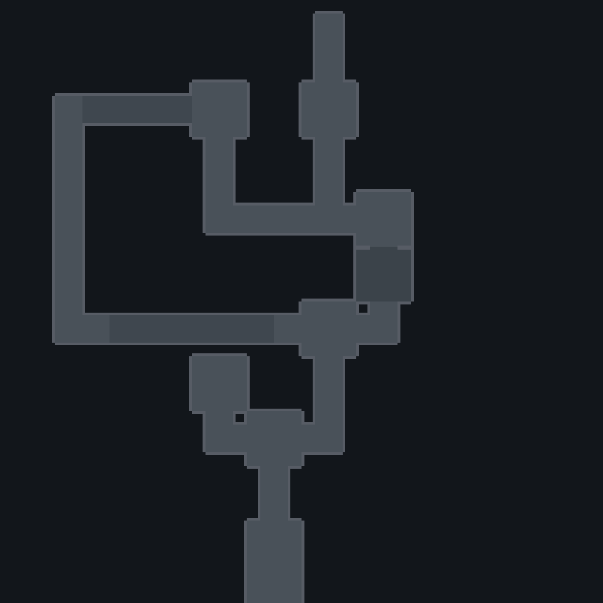
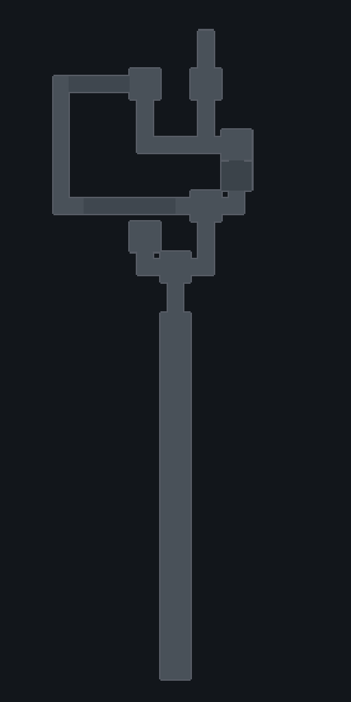
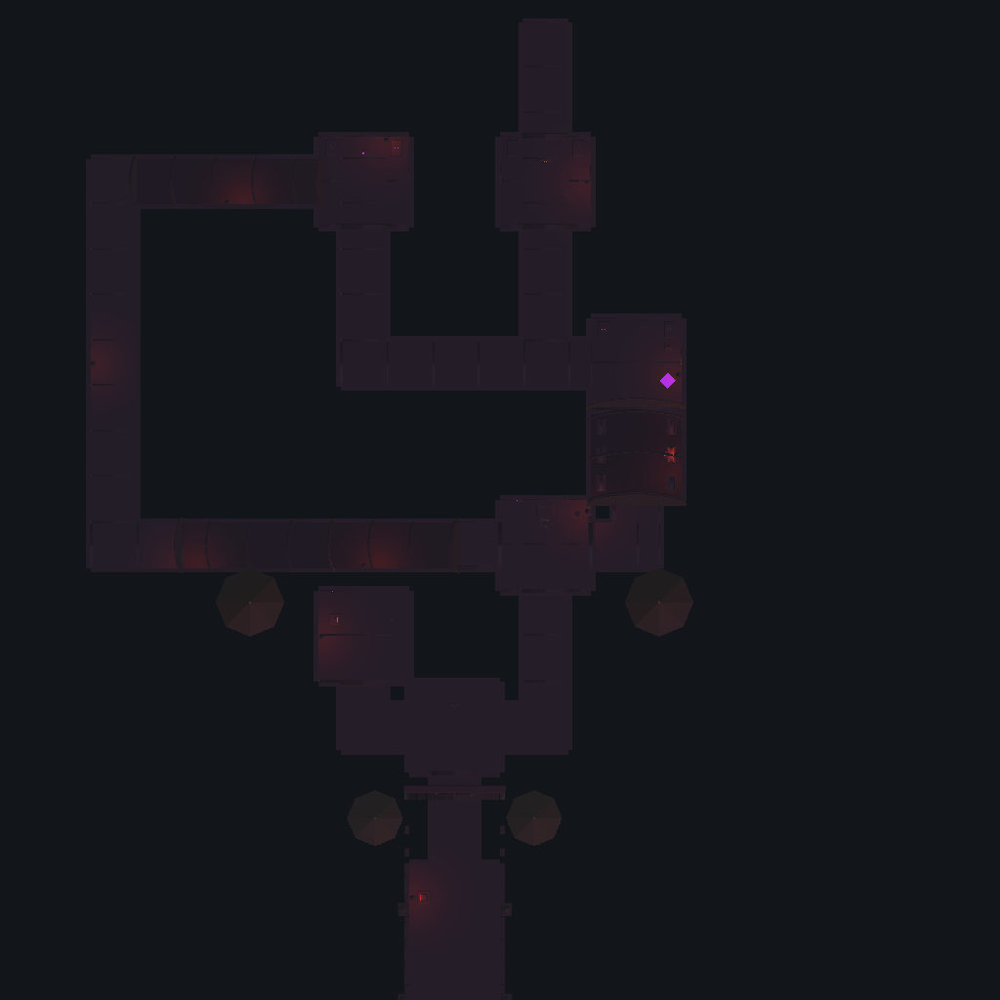

# Saved castle map comparison — 2026-10-01

The saved Unity scene was rendered from above and compared with the original DOCX §8 map, §6 flow chart and [recorded implementation decisions](../design-decisions.md). No unexplained topology mismatch was found. This resolves the missing top-down evidence in #8; ordinary-controls geometry and navigation acceptance remain open.

These are **orthographic Editor camera renders**, not SceneView UI or gameplay screenshots. Unity **6000.6.3f1**, Direct3D11, completed `mapcapture-2` with exit 0 in **219.05 seconds**. The diagnostic helper opened the existing scene without calling a builder or saving it. Its SHA-256 remained `46c4915636110745737ca791cd00144e9c80c09aec35b5983abd06437cb2e1ca` before and after capture.

## Comparison

North is up (+Z), east is right (+X). The first two images cover x=−40..48 and z=−8..80. The original map's 10×10 cells correspond to the implementation's 8 m grid; that scale is an implementation choice.

| DOCX / recorded decision | Observed saved geometry |
| --- | --- |
| Courtyard → first encounter | Southern approach joins the central lower room/junction. |
| Separate puzzle and throne routes | Left puzzle room is a dead end reached from the lower junction. The blank separation from the right/north throne route remains; there is no direct puzzle-to-throne cut-through. |
| Throne → catacombs, with mandatory library | Eastern connector occupies the chosen library position between throne and catacombs. Library placement is a recorded interpretation, not a label in the DOCX map. |
| Upper bonus branch and final arena | Upper-left bonus room and upper final arena remain distinct, connected through the catacomb branch. |
| Secret connection in §6 | Western loop connects the throne side and bonus room. Its geometry and different elevation are recorded implementation choices; top-down projection alone does not prove vertical isolation. |
| Final exit | Exit extends north beyond the final arena. Rendering does not establish its progression condition. |
| Later owner-authorized calm approach | Full-extent image shows the complete extended southern approach, without compressing its relative length. |

### Structural map cutaway

The cutaway enables **153 existing structural renderers**, omits named ceilings, and hides presentation meshes, props, actors and gameplay gates. It uses neutral temporary lighting with fog disabled. It preserves mesh transforms and material assignments. The receipt lists all overrides. It cannot prove collider edges, ramp clearance, gate behavior, secret discovery or ordinary traversal; overlapping storeys can conceal each other.

### Full extent

This view covers x=−46..46, z=−98..86 and retains the actual relative positions of the approach and western return route.

### Saved presentation overhead

Original lighting and fog are retained; only the HUD is omitted. This overhead image is very dark and is retained as context, not an art or visibility pass. The camera is at y=60, above the measured saved visible bounds maximum of y=55. For actual gameplay views, see the [camera gallery](combat-camera-2026-10-01.md#rendered-evidence).

## Reproduction and retained evidence

The reviewed helper is [tools/CaptureCastleLayout.cs](../../tools/CaptureCastleLayout.cs), SHA-256 `534c498e8a24c4f6847234a3507c3b4e2b404ef053cbe24aafa9cccd8496c853`. In an inactive isolated project with frozen inputs, temporarily copy it to `Assets/LevelLayout/Editor/CaptureCastleLayout.cs`, record its generated metadata, set `SHADOWS_MAP_CAPTURE_DIR` to a new absolute output directory and run the pinned graphical batch Editor with `-executeMethod CaptureCastleLayout.Run`. Do not use `-nographics`. Inspect all output, freeze any import differences and restore the exact initial inputs before resuming gameplay validation.

The [raw capture receipt](castle-map-2026-10-01/capture-receipt.json) records projection, scene/helper hashes, room markers, image hashes and visibility/light overrides. [Evidence](castle-map-2026-10-01/evidence.json) binds the native command, execution and frozen source archive. The diagnostic import comprised **662 files**, including the temporary helper/meta; its **62-path delta was 241,295 bytes**. It is separate from the 660-input gameplay/build evidence and does not change that binding.

Unity automatically reserialized **Stone.mat and Wall.mat** when their structural renderers were exposed. The same exact after-payloads occurred in both map attempts: URP defaults were populated, `MOTIONVECTORS` disabled and compatibility colour values round-tripped; authored base colours and material assignments remained unchanged. The receipt's “Materials unchanged” describes the helper's assignments, not the native asset files: these two file changes are explicitly retained in the frozen delta. They were restored to their exact pre-diagnostic payloads after review.

The first attempt rendered three images but exited 6 because Unity rejected restoration of an initially empty scene setup. Its raw outputs and failure diagnostics remain retained locally. The helper now replaces that empty batch setup with a fresh empty scene and records cleanup failures. The second attempt completed successfully; its three published PNGs are unedited.

[Cleanup](castle-map-2026-10-01/cleanup.json) removed only the exact temporary helper/meta (**16,661 bytes**) after editor exit, retaining their archived payloads. All **660 native input hashes** then matched the prior PlayMode42 baseline. The source scene, game build, original project and failure evidence were retained. No standalone player was launched, and no timing or final DOCX acceptance is inferred.
