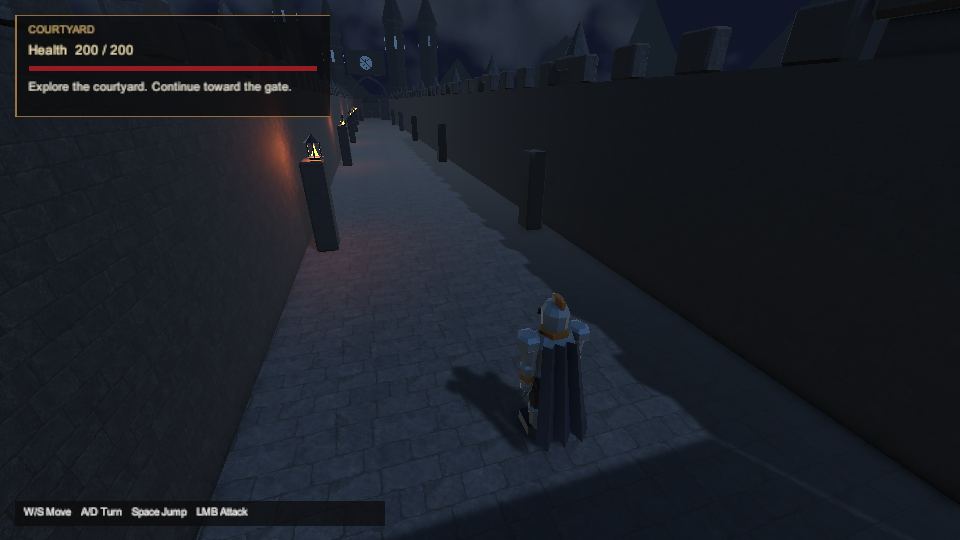
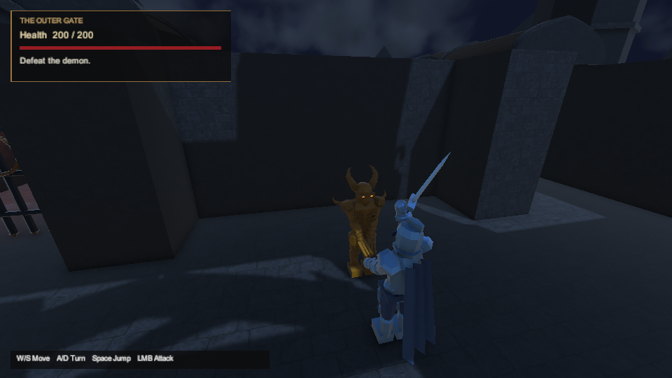
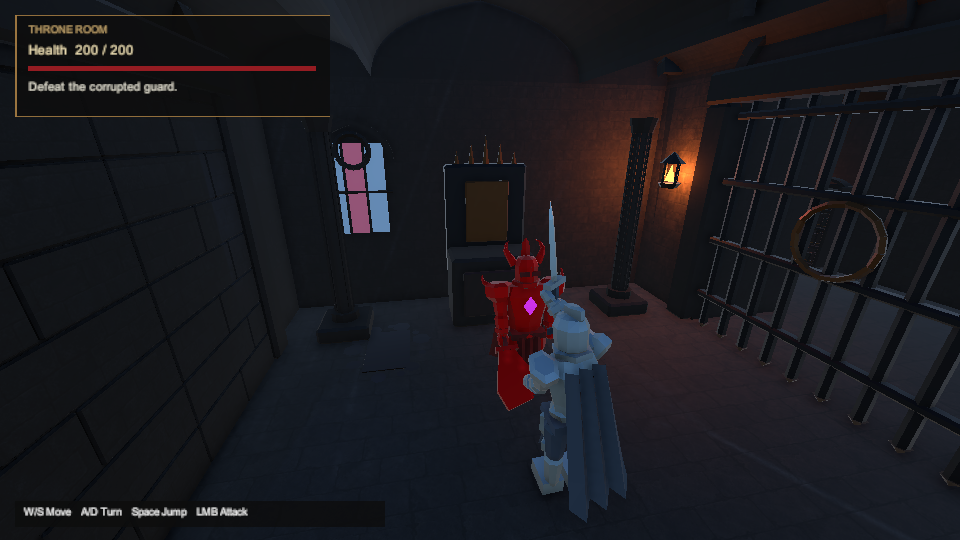
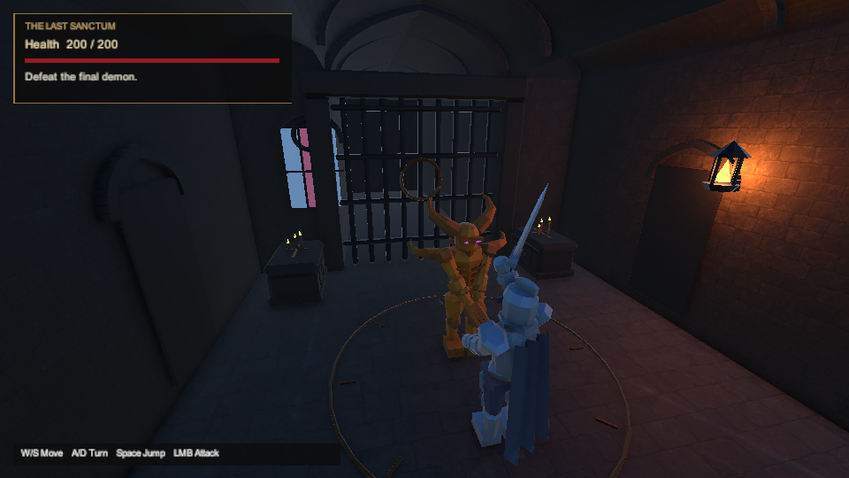

# Combat camera readability — 2026-10-01

DOCX §§1, 3 and 6 require readable action and the three mandatory encounters; §§2, 4–5 also require the castle setting to remain visible. The previous [presentation gallery](gothic-presentation-2026-10-01.md#rendered-evidence) showed the player's body and cloak obscuring enemy windups. This follow-up changes camera framing and adds a regression against the actual articulated actor meshes.

**Guarded-source validation remains incomplete after two disk-reserve aborts.** The final **75° field of view / 1.5 m additional look height** passed **173 EditMode8 and 193 PlayMode25 tests**. Independent review then identified a zero-length aim direction when a moving target's shifted aim coincides with a held camera. The final source adds a safe-direction fallback and one regression without changing scene framing. Its **EditMode9 passed 173/173**; full PlayMode27 and PlayMode29 both stopped at the disk reserve without complete NUnit XML. The guarded suite has **194 expected cases and no complete result**. Headless PlayMode30 and Windows build6 **were not run**. Earlier reports retain their original scope.

## Current candidate

The saved castle scene and its builder select these implementation values, which are not measurements or numbers specified by the DOCX:

| Setting | Candidate |
| --- | --- |
| Distance behind player | 3.0 m |
| Camera height above player origin | 4.0 m |
| Shoulder offset | −1.8 m (left side) |
| Shoulder fraction applied to aiming | 0.5 |
| Collision pivot height | 1.0 m |
| Additional look height | 1.5 m; aim height is therefore 2.5 m |
| Field of view | 75° |

`CameraFollow.lookHeightOffset` and `shoulderAimFraction` change only the aim after camera collision resolution. Their defaults (zero and one respectively) preserve existing scenes. The fraction is clamped to 0–1, with nonfinite values restored to one; the look height is clamped to 0–2, with nonfinite values restored to zero. Collision sweeps retain the existing pivot and near-plane protection, whose clearance follows the camera's field of view. The final wider view and lower aim address the player's cropped framing without moving the collision pivot. The castle's scene/build configuration and camera tests are updated together. Final rendered and runtime verification remains pending.

The final guard uses the validated camera-to-pivot direction when the shifted aim vector has effectively zero length, keeping `Quaternion.LookRotation` from receiving an invalid zero direction. The resolved camera position and collision checks remain unchanged. `MovingTargetAtHeldCameraAimUsesSafeBoomWithoutInvalidRotation` moves the target under a held camera and checks a valid downward orientation, retained safe pose, enabled camera and no unexpected log. This new PlayMode case awaits the final suite result below; its addition raises the expected full count from 193 to 194.

## Actual-mesh regression

`FullCastleRouteTests.Fight` observes an ordinary enemy windup while the existing route test drives normal movement and attack input. It does not teleport actors, inject damage, award progression or advance animation/combat clocks for a screenshot. The first sampled windup in each completed fight must be present.

A fixed **48 × 64 grid, 3,072 rays**, covers the enemy's projected mesh bounds. Bounds only reject unnecessary ray queries; actual front-facing mesh triangles determine the first enemy surface and any nearer player surface. The calculation respects active/enabled renderers, camera layers and the player's existing `forceRenderingOff` state. Head, torso and attacking-arm regions follow the articulated hierarchy. Both demon arms are checked; the guard's right weapon arm is checked. Other enemy surfaces still participate in self-occlusion.

Each region requires **at least 12 silhouette samples and at least 50% visible samples**. This is an implementation floor against a mostly hidden attacker, not a human-readability score or a percentage required by the DOCX. The denominator consists of that region's frontmost enemy silhouette samples before player occlusion. Samples outside the viewport count against visibility. The thresholds have not been lowered to make the camera trials pass.

The numeric check remains enabled when `SHADOWS_CAPTURE_DIR` is absent. An uncreated render-target descriptor establishes the same **960×540, 16:9** camera pose as the optional PNG; GPU rendering is requested only when captures are enabled. Temporary target, canvas, shader-compilation and close-body-visibility state is restored in `finally`. Four added CPU ray cases cover misses, backfaces, the exclusive distance bound and nearest hits with an unlabelled player surface. The early main-route-only trials did not select those cases; all four subsequently passed in full PlayMode21.

When captures are enabled, each sampled fight writes its original PNG and a `-framing.json` sidecar before visibility assertions. The sidecar records region counts/fractions, ray and mesh counts, actor/camera positions, camera settings and measurement time. Pivot/look-height/aspect fields were added for PlayMode17 onward. These are geometric player-occlusion measurements: they do **not** establish visibility through environment geometry, lighting quality, attack comprehension, human play, standalone behavior or performance qualification.

## Retained camera trials

All five attempts below selected only `CastleMainRouteCompletesThroughControlsWithoutSecret`, used pinned Unity **6000.6.3f1**, and ended naturally with native runner **exit 8**, **0 passed / 1 failed / 0 skipped**, with no runner stop condition. Attempts 15–18 stopped at the first encounter. Attempt 19 reached the throne fight; none supplies final-fight or completed-route evidence.

| Attempt | Camera configuration | Runner / XML suite time | Finding |
| --- | --- | --- | --- |
| PlayMode15 | Distance 3.5, height 2.8, shoulder 1.4, previous aim | 549.33 s / 30.1352222 s | **Invalid visibility measurements:** the ray helper returned a finite search bound on a miss, then compared it with a repeated subtraction. Its output incorrectly classified every sampled region as fully blocked, contrary to the PNG. Retained for diagnosis; these zero fractions are not accepted camera measurements. |
| PlayMode16 | Same camera as PlayMode15; corrected explicit miss result | 201.02 s / 22.8829056 s | Head **285/285 (100%)**, torso **196/238 (82.35%)**, right arm **85/238 (35.71%)**, left arm **249/249 (100%)**. The right arm genuinely misses the unchanged 50% floor. |
| PlayMode17 | Distance 3.5, height 3.3, look offset 1.3, shoulder 1.4 | 52.11 s / 22.4286998 s | Head **276/276 (100%)**, torso **237/237 (100%)**, right arm **112/252 (44.44%)**, left arm **253/258 (98.06%)**. The right arm still fails; raising the camera alone is insufficient. |
| PlayMode18 | Controlled old-scene negative: distance 5, height 2, shoulder 1.4, look offset 0 | 50.05 s / 22.4429632 s | Head **189/250 (75.60%)**, torso **72/238 (30.25%)**, right arm **0/236 (0%)**, left arm **237/246 (96.34%)**. The corrected regression detects the older scene's torso/arm obstruction. This expected failure is not a passing route. |
| PlayMode19 | Distance 3.5, height 3.3, look offset 1.3, shoulder 1.8 | 78.39 s / 44.5854775 s | First demon: head/torso/left arm **100%**, right arm **193/252 (76.59%)**. Miniboss: head **160/160 (100%)**, torso **301/303 (99.34%)**, right arm **180/518 (34.75%)**. The first fight meets the geometric floors; the miniboss still fails. |

PlayMode15's helper now returns positive infinity for a miss and tracks a real hit independently from its region label; player surfaces legitimately have region `-1`. This correction separates a missing intersection from the finite distance bound. Sampler execution for the first fight was **34.27 / 36.04 / 63.55 / 35.96 ms** in attempts 15–18 respectively; these instrumentation timings are not game-frame budgets.

PlayMode19's sample measurements took **33.42 ms** for the first demon and **25.77 ms** for the miniboss. Its first-fight improvement does not justify weakening the arm threshold for the larger guard or claiming a complete main-route pass.

PlayMode18 uses the **exact castle scene from main `6000573cb859aad4ff1b6abada4e527c318420db`**, with all other native inputs retained from frozen PlayMode17, including the corrected sampler and the component's default-zero look offset. It is a controlled scene comparison, not an execution of the complete historical main source. The candidate source worktree was not changed for that negative control.

## Diagnostic camera comparison

PlayMode20 used a separately frozen temporary test variant, outside the tracked source. At the same ordinary first-demon and guard windups it evaluated 16 combinations of distance (3 / 3.5 m), height (3.3 / 4 m) and shoulder (−1.8 / −1.4 / 1.4 / 1.8 m), using half of the shoulder shift for aiming. Every candidate retained collision resolution, and none hid the player. The original settings were restored before the normal assertions; the run still ended with the original guard-obstruction failure. This is a bounded diagnostic comparison, not a route acceptance pass.

Candidate 9 selects 3.5 m distance, 3.3 m height and −1.4 m shoulder. Its measured region fractions were **100 / 100 / 87.2 / 66.5%** for the first demon and **91.4 / 81.0 / 94.5%** for the guard. Both camera booms remained unretracted, unlike the wider 1.8 m alternatives. These measurements justified a normal follow-up trial and the saved-scene change; they do not substitute for it. The diagnostic variant is removed from the final native inputs and was never added to the tracked test source. The artifact `camera-candidate-matrix.json` retains all 32 comparisons and source hashes, SHA-256 `38574f6f1d85f12f3611514cbd8ae2cd6c6046221751e2f06a858bcb771f5144`.

## Full-suite check and wider diagnostic

That candidate subsequently passed **EditMode6: 173/173, 0 failed/skipped**, **25.31 s** runner / **1.4435319 s** XML suite, native exit 0. Full **PlayMode21 failed: 190/193 passed, 3 failed, 0 skipped**, **328.22 s** runner / **303.8610856 s** XML suite, native exit 8. All **15 new aim-parameter cases** (seven look-height and eight shoulder-fraction cases) and all **four CPU ray cases** passed. These passes do not override the three actual-actor visibility failures:

| Route case / sampled fight | Failed left-arm visibility |
| --- | --- |
| Main route / final demon | **77/172 = 44.77%** |
| Secret route / first demon | **69/210 = 32.86%** |
| Throne-death route / first demon | **70/211 = 33.18%** |

These runs show why a favorable sample from the earlier two-pose diagnostic was insufficient. The same unchanged 50% criterion also applies to the different ordinary windup poses reached by the other routes.

**PlayMode22** used a separately frozen diagnostic variant of the whole `FullCastleRouteTests` fixture. It finished with **8/10 passed, 2 failed, 0 skipped**, native exit 8, **360.48 s** runner / **332.4161688 s** XML suite, with no runner stop condition. The main-route and throne-death cases retained first-demon visibility failures under their normal settings. The diagnostic evaluated **112 combinations: 16 configurations × seven observed poses**, covering first-demon, guard and final-demon views across the route cases. All 112 diagnostic camera poses were collision-safe, reported no diagnostic error and kept the player body visible. The results remain a camera search, not a passing final suite or ordinary rendered traversal with the selected settings.

| PlayMode22 diagnostic configuration | Lowest region visibility across its seven poses |
| --- | --- |
| Candidate 4: distance 3, height 4, shoulder −1.8, look height 2, aim fraction 0.5 | **89.25%** (`0.8925233483`); selected for the next normal runs |
| Candidate 0: distance 3, height 3.3, shoulder −1.8, look height 1.3, aim fraction 0.5 | **84.36%** (`0.8436018825`) |
| Candidate 9: previous 3.5 / 3.3 / −1.4 / 1.3 / 0.5 configuration | **34.12%** (`0.3412322402`) |

The selected wider shoulder can retract when collision clearance requires it. That behavior must be checked in the normal final camera tests and saved scene; the diagnostic does not justify relaxing near-plane clearance or requiring an unsafe full shoulder offset inside a narrow corridor. No diagnostic candidate sweep belongs in the final tracked route test.

## Passing intermediate camera and final composition revision

The diagnostic's higher candidate (distance 3, height 4, shoulder −1.8, look height 2, aim fraction 0.5, FOV 60°) subsequently passed both full suites:

| Historical candidate run | Recorded result |
| --- | --- |
| EditMode7 | **173/173 passed, 0 failed/skipped**, native exit 0; **25.23 s** runner / **1.4052808 s** XML suite |
| PlayMode23 | **193/193 passed, 0 failed/skipped**, native exit 0; **473.05 s** runner / **446.8338213 s** XML suite |

These results include the ordinary route and camera regressions for those inputs. Nevertheless, actual PlayMode23 courtyard and first-fight images cut the player's lower body at the bottom of the frame. The enemy-surface visibility floor does not evaluate the player's complete composition. Widening the saved camera to **75°** and reducing its look-height offset from **2 to 1.5 m** is a further implementation correction, not a claim that the previous test passes prove final visual acceptance.

For the final composition before the zero-aim guard, **EditMode8 passed 173/173, 0 failed/skipped**, native exit 0, **27.19 s** runner / **1.5650785 s** XML suite. Full **PlayMode25 passed 193/193, 0 failed/skipped**, native exit 0, **471.72 s** runner / **447.5501954 s** XML suite. These are valid results for that composition and its recorded source. Neither the passing PlayMode23 run nor its captures are relabelled as evidence for the final field of view.

After the guard and its regression were added, **EditMode9 passed 173/173, 0 failed/skipped**, native exit 0, **27.66 s** runner / **1.5310216 s** XML suite. The scene/framing values remain identical to PlayMode25, but the changed C# sources still require a complete full PlayMode result, headless verification and build6. The review gallery below uses actual PlayMode25 captures clearly labelled **before the zero-aim guard**. Those images show the same scene composition; they do not qualify the guarded C# or its new regression. Earlier and interrupted-run captures remain separately scoped.

## Interrupted guarded-source runs

PlayMode27 was stopped by the runner after **198.36 s**, exit **1**, with stop condition **`Disk reserve/cap reached`**. Windows free space briefly fell below the configured **60 GiB reserve**; no complete NUnit XML was produced. This is an incomplete infrastructure run, not a gameplay pass or an observed regression failure. Free space subsequently recovered above 73 GiB on three checks, allowing PlayMode29 to retry the same inputs with the same reserve.

The interrupted run's frozen archive retains **662 files**, including the two Unity Test Framework-generated `InitTestScene04638dfb-ec28-4308-bad0-2ba881dc1322.unity` and `.meta` files left by shutdown. All other inputs remained unchanged. Once the editor was inactive, only those two exact files (**5,901 bytes**) were removed from the native input project after hash, owner, containment, age and exclusive-open checks. Both payloads remain in the run's delta archive; `camera-aborted-init-cleanup.json` records their removal. The original project, real scenes and all trial diagnostics remain retained.

PlayMode29 also stopped with **`Disk reserve/cap reached`**, exit **1**, after **57.77 s**, with **no complete NUnit XML**. Its freeze retains **660 files**, a **57-file delta of 222,672 bytes**, and **zero changes during the run**. Neither interrupted attempt provides a complete pass for the guarded source or its new PlayMode regression.

At the second interruption, Windows had approximately **55.9 GiB free**, with a **36 GB pagefile** under memory pressure. The earlier 73 GiB recovery was temporary. The **60 GiB reserve remains unchanged**; no relaxation was authorized. Cleanup subsequently removed **1,168,552,977 logical bytes in 28,793 files** from inactive `project-clean/Library` and `project-clean/Temp`, with exact allowlists, stable snapshots, ownership/containment checks and exclusive opens. The retained report is `cleanup-clean-project-intermediates-retry-20261001-084148-8329487.json` (completed in 624.377 s). Source, all raw captures, failed-run diagnostics and prior builds were retained. Observed Windows free space increased by 17,678,929,920 bytes during cleanup; that larger change includes unrelated host activity and is **not attributed to this task**. Earlier task-local Linux cleanup removed 104,112,961 logical bytes (106,848,256 allocated bytes) of reproducible .NET caches/intermediates, retaining TRX/log evidence; no WSL compaction or Windows allocation recovery from that Linux deletion is claimed. **Headless PlayMode30 and Windows build6 were not run.**

## Provenance and completed headless checks

The source branch starts from main `6000573`; its original Unity input archive is bound to `8602b8e38f0f933c01efc00b0f42fd50bf71659a`. Local native artifacts are retained under `artifacts/full-route-unity` in the original Windows checkout. Each completed run has `execution.json`, `source-before.json`, XML and logs; rendered runs retain unique captures. PlayMode15 additionally has its post-import source map/delta; PlayMode16–23, PlayMode25, interrupted PlayMode27/29 and EditMode6–9 have `frozen-inputs.json` and reconstructible delta archives. The interrupted runs lack complete XML. These preserve trial inputs while later source changes continue.

The worktree artifact `artifacts/validation/camera-trials-summary.json` binds PlayMode15–17, their captures and earlier headless logs (**SHA-256 `808741f8a1bf7f964e279ed4b033819a59331ef6c0de8d313045484575a90204`**). It intentionally does not contain PlayMode18 or later attempts. The separate negative-control receipt is `camera-old-framing-negative-control.json`, **SHA-256 `3506ba6187c5404856d08ed47ff67296aeb7c41f8da4b9147f8ed58fec32ea95`**. PlayMode18's frozen source manifest has **SHA-256 `9a5a027872c4254c619a347f6570004a42e9789be3f794de49e04c663b99a7dd`**; its delta archive has **SHA-256 `1064bc10063a767318f1a1a80b5a110e9e4f6a97af0a5a8d736156cb62e55b22`**.

The frozen PlayMode15 import review verified **659 initial inputs / 660 imported files**, with **616 exact files, 44 reviewed changed/added paths, 63 exact C# files and zero unresolved findings**. This checks import drift for those trial inputs; it does not turn PlayMode15 into a pass or establish later rendered parity. Later freezes remain separately bound.

The historical `camera-final-input-review.json` binds the **EditMode6 candidate**, despite its filename: **659 worktree / 660 frozen files**, all **63 C# / 335 metadata / four scenes** exact, and 44 previously reviewed exact hash pairs with no unresolved import findings. Its SHA-256 is `923f9d4505654d607f43a0604042f94f327a430df2a96bd848f057afb0450f5a`; it does not automatically bind the later candidate.

The full PlayMode21 run changed **seven demo materials** relative to frozen EditMode6: three under `Assets/Combat/Demo` and four under `Assets/Interactions/Demo`. Fresh comparison of both reconstructed 660-file sets found only compatibility `_Color` RGB round-trips, maximum **5 × 10⁻⁸**, plus trailing whitespace. Authored `_BaseColor`, alpha and all other serialized properties remain unchanged. `camera-demo-import-review.json` records the seven complete before/after pairs and **zero unresolved findings**, SHA-256 `3f9e5b5bc0a4475b5c74a8986075c5dd948f9f01d21a3afc4d9224ac4db860c5`. These can supplement the prior 44 reviews only when a later path and both complete hashes match. This material review does not pass PlayMode21 or establish rendered parity.

The intermediate **EditMode7** binding remains in `camera-delivery-input-review.json`, SHA-256 `b8b87363aaf57f8d1c6cedc5fa12c525ff43dd282c95e5811853547277c5e24d`. The **EditMode8** composition before the guard remains bound by `camera-release-input-review.json`, **SHA-256 `79dbdf0edf47c199752aed5529621fa1fd1f7bd0e6547a7a5f4bfffc1d117af8`**. It is historical after the two C# files change; it does not automatically bind the guard.

The final guarded source has a new **EditMode9** binding: `camera-guard-input-review.json`, **SHA-256 `deb2c4ddfc3a64466ad81382a038e8832714025e2cc928cbb15aee2dbdb34426`**. It reconstructs all **660 frozen files** from the verified base plus 57-file delta, matches the pre-run/execution maps, and compares all **659 worktree inputs**: **609 byte-exact files**, all **63 C# / 335 metadata / four scenes** exact, and **51 changed/added paths** whose complete before/after hashes match the 44+7 review catalog. There are **zero unreviewed pairs or unresolved import findings**. This source binding includes the guard and unchanged FOV 75° / look-height 1.5 configuration; it is not a substitute for pending runtime and build results.

Already executed during this camera work:

| Check | Recorded outcome and scope |
| --- | --- |
| Python tooling | **84 passed**, 7.484 s; `camera-python-final.log`, after the guard source and status documentation changes. Earlier `camera-python.log` remains retained. |
| Pure C# progression | **29 passed, 0 failed/skipped**; retained `camera-dotnet/Progression.trx`. |
| Pure C# camera core | **32 passed, 0 failed/skipped**; retained `camera-dotnet/Camera.trx`. Together the two .NET suites total **61 passes**; they do not compile the `CameraFollow` MonoBehaviour or execute mesh/camera integration. |

An earlier Linux .NET launch could not find `dotnet`; an initial PowerShell launch rejected the unsigned UNC script. Neither executed tests. The later native .NET log and TRX files establish the successful runs above; the failed-launch logs remain retained.

## Pending validation and acceptance

| Required follow-up | Current recorded status |
| --- | --- |
| Final guarded composition after passing PlayMode25 | Distance 3 / height 4 / shoulder −1.8 / look height 1.5 / aim fraction 0.5 / FOV 75°; final rendered validation **pending** on the guarded source. |
| Final full EditMode9 and guarded PlayMode suite | **EditMode9 passed 173/173**. **PlayMode27 and PlayMode29 aborted at the disk reserve**, without complete XML; 194 cases are expected, with no complete guarded-source result. Earlier full passes remain scoped to their own source. |
| Headless PlayMode30 | **Not run**; geometric verification without optional PNG capture remains pending. |
| Source/contract/Python and relevant .NET checks | Source integrity and unchanged DOCX contract passed; **84 Python** and **61 relevant pure C# cases** passed, with the scope above. These do not supply the unfinished guarded PlayMode result. |
| Windows build6 and final source/import binding | **Build6 not run**. EditMode9's guarded source/import binding is complete; later run/build maps must match. Historical build5 covers the earlier presentation inputs. |
| Actual rendered gallery and final evidence receipt | The **pre-guard PlayMode25 gallery** below is retained with exact source comparisons. A guarded-source PlayMode/build delivery receipt remains **pending**. |
| Standalone main/secret/death/restart, human readability, pacing and performance | **Deferred/pending** under the owner's instruction to continue implementation and test later. |

No standalone player has been launched for this work. The [DOCX acceptance matrix](../docx-acceptance.md) remains authoritative for the broader unfinished acceptance scope. The GitHub Unity activation prerequisite still needs its configured secrets; an authorized activation-only merge exception is not a CI engine-test pass.

## Rendered evidence

These four **unaltered 960×540 PNGs are actual Unity scene-camera captures from passing PlayMode25**, before the zero-direction fallback and its regression were added. They are not captures of a completed guarded-source run. The scene, authored camera settings and all actor/art inputs are unchanged between that run and EditMode9.

The [preview receipt](combat-camera-preview-2026-10-01/preview-evidence.json) verifies both successful NUnit reports, frozen payloads, runner hashes and gallery hashes. It retains the exact two-file difference: three fallback lines in `CameraFollow.cs` and one 19-line test addition; all other 658 native inputs match. The [current input review](combat-camera-preview-2026-10-01/inputs.json) binds 659 worktree files to EditMode9's 660 imported files and its 51 reviewed import pairs. The preview also records both interrupted attempts and the unexecuted headless/build checks. Neither receipt presents the old run as validation of the final guard.

The courtyard view includes the complete player and the castle skyline. These views do not establish the duration or human discoverability of the approach.

In these sampled main-route windups, the lowest required-region visibility is **100%** for the first demon, **93.98%** for the guard and **93.51%** for the final demon. All measured regions meet the unchanged 12-sample/50% floors. Visual review shows the player's boots/cape and the enemy attack poses without wall intrusion or HUD obstruction in these fight images. The separately retained final-approach image still crops the player's lower body. Continuous-motion comfort, lighting comprehension and human play remain unqualified.
