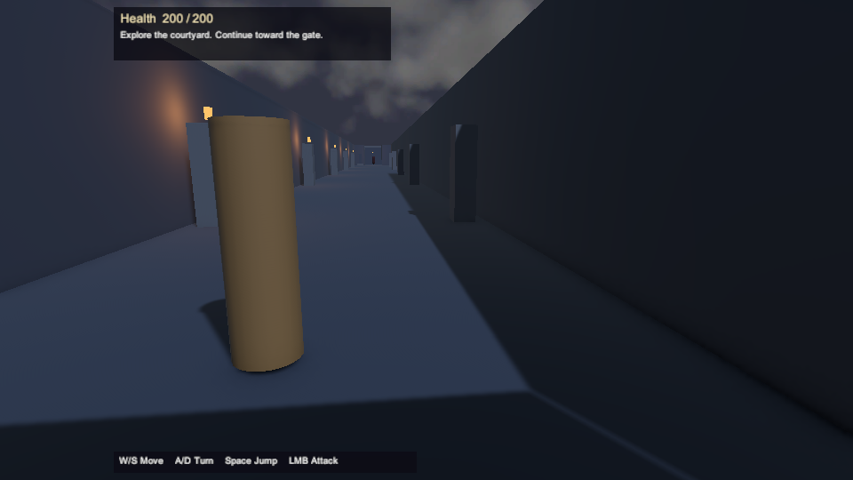
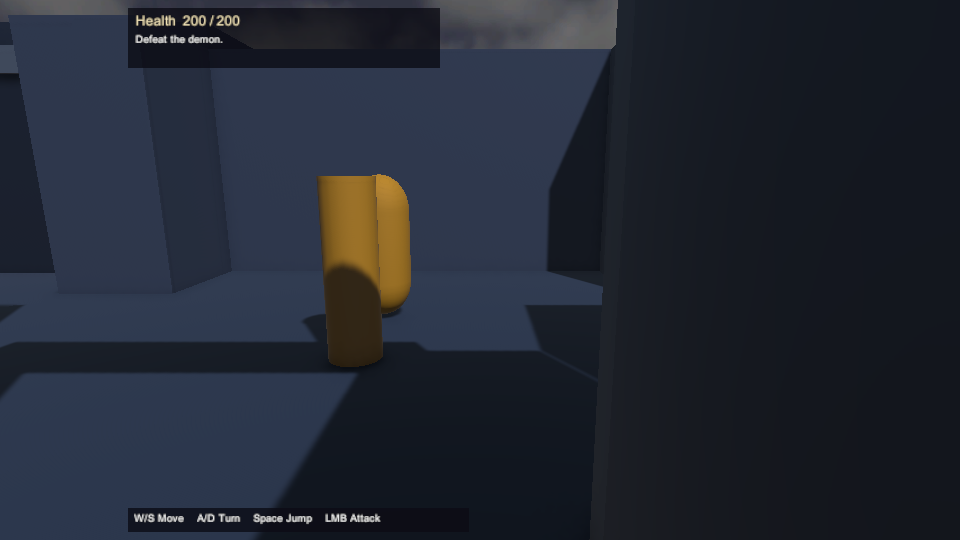
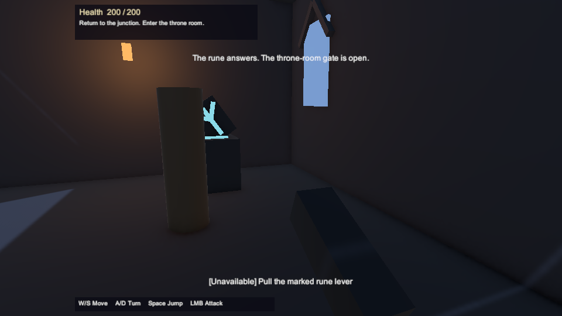
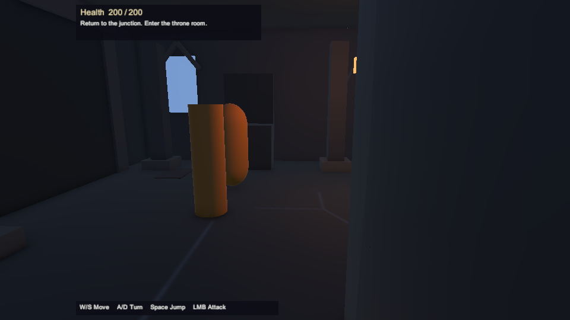
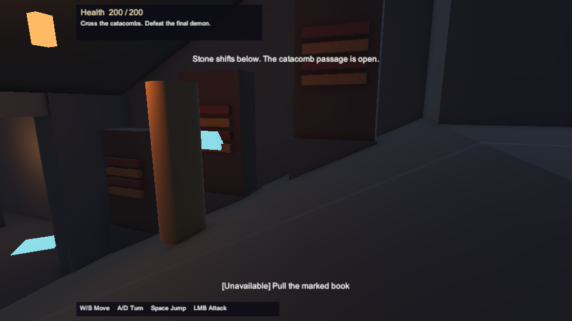
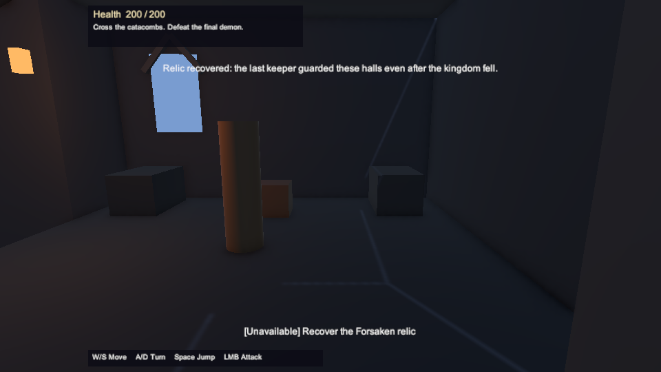
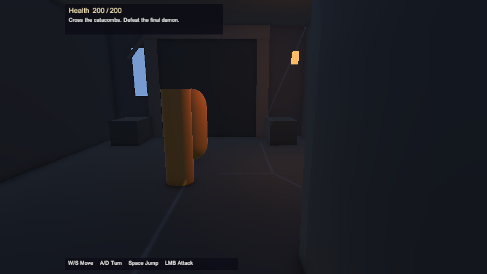
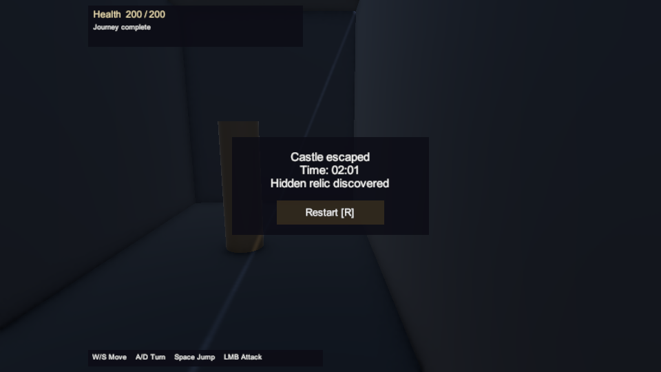

# Full castle route: local validation, 2026-09-30

Implements DOCX §1, §3–4 and §6–8 through the approved simple-mechanism plan: a 100 m calm approach, three distinct encounters, rune lever, mandatory library book, catacombs, optional relic and underground return shortcut, final fight, exit and full restart. The source DOCX and progression contract are unchanged. See [implementation choices](../full-castle-route.md) and [design decisions](../design-decisions.md).

## Environment and provenance

Work started from main `be9e2a43887d186e86cf51e58853ada8fce0e727` in an isolated branch/worktree. The original checkout's uncommitted package/project settings were preserved. Native Windows Unity **6000.6.3f1**, D3D11, the installed local license and Unity Hub CLI perform scene authoring, engine tests and the player build. Editor and package pins remain unchanged.

An isolated ordinary-file Windows copy contains only the branch's Assets, Packages and ProjectSettings plus its own generated cache. The initial cold import succeeded. Later authoring, tests and build reuse that cache; this does not claim a fresh cold-cache pass of the final source. The saved scene and NavMesh come from `CastleLayoutBuilder.BuildForBatch`; trailing whitespace in Unity YAML is normalized without changing serialized values. Exact native, committed and tested hashes are retained separately. Import adds URP asset-version metadata to castle/demo materials, rewrites emission keyword lists, normalizes whitespace and rounds serialized material color values. Exact differences are retained rather than claiming byte-identical imported assets. ProjectAuditorSettings differs only in whitespace. Player building also writes shader prefilter/runtime-setting lists and upgrades the default volume profile. Full imported source snapshots and diffs are retained; these automatic rewrites are not copied into the branch.

## Validation

The final engine suites passed **169/169 EditMode** and **162/162 PlayMode**, with no skipped cases. PlayMode attempt 10 used `-disableaudio` after Windows changed its output device during the preceding attempt (details below); audio playback is not covered. Confirmed headless results are **84 Python** and **160 .NET** tests: progression 29, movement 36, camera 32, interactions 17, combat 46. Python validates source/design tooling; .NET compiles the same deterministic production C# cores as Unity. Neither substitutes for MonoBehaviour, physics, navigation or player execution.

The Windows x64 build succeeded: **0 build errors, 0 build warnings, 123,103,498 reported bytes**. The final known-route Unity input runs recorded **81.58 s without the secret** and **122.85 s with the relic and return shortcut**. These timings demonstrate reachability and expose a pacing follow-up; they do not certify the 2–3 minute first-time basic route.

`FullCastleRouteTests` loads the saved playable scene and sends W/S, A/D, E, LMB and R through its actual input map. It never teleports the player, injects damage or sets progression flags. Cases cover the mandatory route without the secret, relic/shortcut route, death and reset at each of the three fights, and walking/jumping against locked early gates. Existing separate regressions cover stale sessions/lives, blocked interactions, room bounds, occupied gate closure, enemy detours/leashes and terminal input. Geometry-only tests explicitly isolate gameplay and do not count as route completion.

## Reproduction

Run the Python and five .NET commands documented in README. The native editor operations are explicit; opening/importing the project does not rebuild the scene:

```powershell
unity.exe run <project> --editor-path <6000.6.3f1/Editor/Unity.exe> --timeout 1800 --no-tail --non-interactive --no-log-proxy --log-file <author.log> -- -executeMethod CastleLayoutBuilder.BuildForBatch
unity.exe test <project> --mode EditMode --editor-path <6000.6.3f1/Editor/Unity.exe> --timeout 1800 --output <editmode.xml> --non-interactive --no-log-proxy -- -assemblyNames Shadows.EditMode.Tests -logFile <editmode.log>
unity.exe test <project> --mode PlayMode --editor-path <6000.6.3f1/Editor/Unity.exe> --timeout 1800 --output <playmode.xml> --non-interactive --no-log-proxy -- -assemblyNames Shadows.PlayMode.Tests -logFile <playmode.log> -disableaudio
$env:SHADOWS_PLAYER_OUTPUT = 'C:\validation\player\ShadowsOfTheForsaken.exe'
unity.exe run <project> --editor-path <6000.6.3f1/Editor/Unity.exe> --timeout 1800 --no-tail --non-interactive --no-log-proxy --log-file <build.log> -- -executeMethod CastlePlayerBuild.BuildForBatch
```

The builder includes only `ForsakenCastle.unity`. Keep the executable with its generated data directory and Unity libraries. Launch normally on Windows x64; W/S move, A/D turn, Space jumps, LMB attacks, E interacts, and R restarts after defeat or completion.

`SHADOWS_CAPTURE_DIR` optionally enables actual scene-camera PNGs during PlayMode, including the camera-space HUD. `SHADOWS_PLAYER_EVIDENCE_DIR` optionally enables a read-only observer in the standalone player: atomic `status.json` every 0.2 s and at most 10,000 milestone lines in `events.jsonl`. It accepts an absolute local directory, never supplies gameplay commands, and creates no files when unset. External readers on Windows must allow delete-sharing for atomic replacement. This is local validation instrumentation, not a gameplay save or network service.

The session clock measures focused, unpaused running time from session initialization to exit; loading, terminal screens and loss-of-focus gaps are excluded. Death ends a failed attempt and R starts a new clock. Known-route automation timings are reported separately from human discovery and cannot certify the DOCX's 2–3 minute basic-exploration target.

## Failures retained and corrected

The first native compile caught duplicate local variable names in the restart input branch; names were corrected. CLI invocations initially repeated flags owned by Unity Hub CLI (`-quit` and `-testFilter`); corrected invocations use the CLI's own controls.

The first two full-route tests reached exit and restart but failed on an unexpected diagnostic log. The test now explicitly expects its own diagnostic. The next full suite passed 155/158: both complete routes and all three real death/restart cases passed. Its remaining three failures were isolated camera/navigation fixture assertions: a player-body visibility ray did not model the visible cylinder, one movement boundary demanded strictly greater after stopping at equality, and one detour assertion demanded movement past the intentional stopping distance. Corrected tests retain real movement, obstacle avoidance, body visibility and near-plane checks.

A further full run passed 158/159. The new gate-jump test exposed a real camera limitation when turning away with a closed gate immediately behind the desired camera position; its physics and progression assertions passed, but the camera suspended rendering. This failure is retained separately. The camera now revalidates its prior position from the current pivot when both normal candidates fail, using unchanged collision and visibility queries. Teleports, target changes and explicit snaps cannot reuse this fallback. All 25 focused camera tests and the actual saved-scene gate case passed after the fix. The complete EditMode suite then passed 169/169.

Visual review exposed player-body occlusion in melee. The castle uses a 1.4 m shoulder offset and hides only its own assigned body renderers when collision pushes the camera very close. Defaults in independent demo scenes remain unchanged. Physical library gate shoulders prevent walking around the panel at the wider landing; the exit volume lies beyond the final gate.

The next complete PlayMode run passed **160/160**, including the camera fix. Standalone validation then exposed an observer I/O failure: the first pilot reached real combat but lost its optional evidence stream at approximately 36 seconds. That pilot is a failure, not a completed route. Its source snapshot, build hashes, log, inputs and images remain retained. The writer now retries up to ten consecutive snapshot I/O failures, preserves the previous complete JSON and records operation/HResult/cumulative count. A real exclusive-file-lock regression passed. The exact external cause of the original contention is unconfirmed.

The first player also logged three NavMesh registration errors during scene startup before agents subsequently moved. Castle agents are now serialized disabled and explicitly register after the surface has enabled and nearby matching navigation data is available. A focused regression covers waiting without moving the actor. One authoring attempt started before source synchronization completed; it was excluded, then rerun after input hashes matched the completed snapshot.

The final-source PlayMode attempt 9 passed **161/162**, with no skipped cases. The main-route test reached completion but failed its test result on an unexpected FMOD error after the default Windows audio device changed. That run remains failed. The rerun uses the installed editor's `-disableaudio` command-line switch; no log assertion or production setting was changed to suppress the error. Attempt 10 then passed **162/162**, with all six saved-scene route/death/gate cases passing and no skipped cases. Audio playback is outside its coverage.

The rebuilt Windows player starts and the three initial NavMesh registration errors are absent. Its observer recovered two snapshot-publication I/O errors (`0x80070497`) during an idle run. Four unused URP post-processing shader warnings remain (Gaussian/Bokeh depth of field and Panini projection); their visual functionality has not been accepted. Later OS-input attempts could not acquire focus; a scoped process check identified `LockApp.exe` as the foreground window. No input was sent to that window, and each owned game process was closed normally. Three complete Windows main-route runs, one secret-route run and standalone death/restart remain pending an unlocked desktop. Successful Unity PlayMode routes do not replace those player checks.

## Evidence and remaining acceptance

[Machine-readable evidence](full-castle-route-2026-09-30/evidence.json) records per-file native inputs, authoring/build/test results and exact import differences. The [gallery manifest](full-castle-route-2026-09-30/gallery.json) identifies eight unchanged Unity PlayMode scene-camera captures from the passing secret-route case in the otherwise failed attempt 9. They are not standalone screenshots:

| Courtyard | First encounter | Rune lever | Throne guard |
| --- | --- | --- | --- |
|  |  |  |  |

| Library | Optional relic | Final fight | Secret completion |
| --- | --- | --- | --- |
|  |  |  |  |

Raw commands, each attempt's reports/logs, input hashes, route input traces, native authoring hashes and unique images are retained under `artifacts/full-route-unity` in the original checkout. .NET TRX reports and source checks live in the isolated worktree's `artifacts/validation`. Failed attempts remain distinct from final passes.

Final gothic art/atmosphere, a human first-time playtest, performance qualification and acceptance of the 2–3 minute target remain separate work. The standalone check uses ordinary OS input controlled by an agent and read-only observations; it must not be described as a human playtest. GitHub Actions Unity activation is also separate from the working local license.

## Cleanup

Removed 22 verified Linux task-local paths: `artifacts/nuget`, `artifacts/dotnet-home`, and `bin`/`obj` directories for the five .NET test projects and their Core projects. These held 118,359,541 logical bytes; observed Linux free-space increase was 122,458,112 bytes, with 867,146,743,808 bytes free afterwards. The allowlist, ownership/containment/inactivity checks and measurements are retained in `artifacts/validation/linux-cleanup.json`. This does not establish Windows VHD allocation reclamation. The native Unity processes have exited. Allowlisted Windows cache cleanup is running separately; its final measurements are retained in the task-local cleanup report. Raw failures, unique screenshots, reports, hashes and the Windows deliverable are retained.
