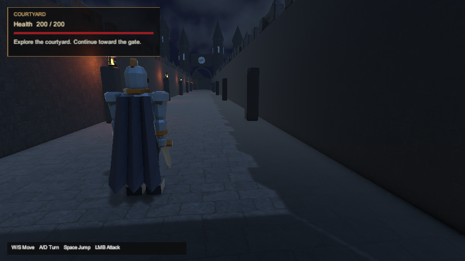
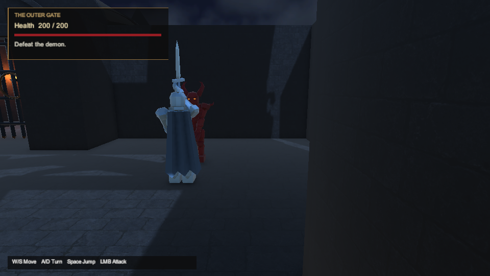
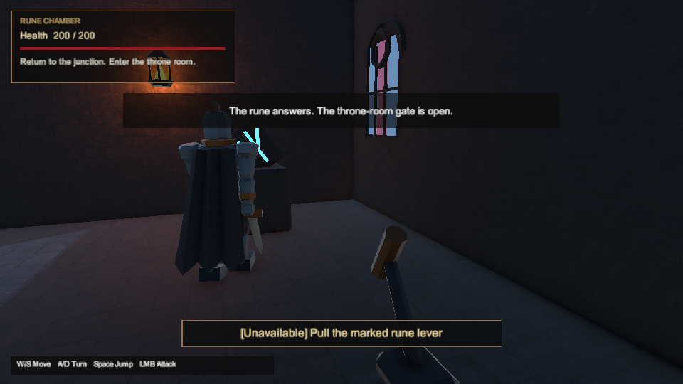
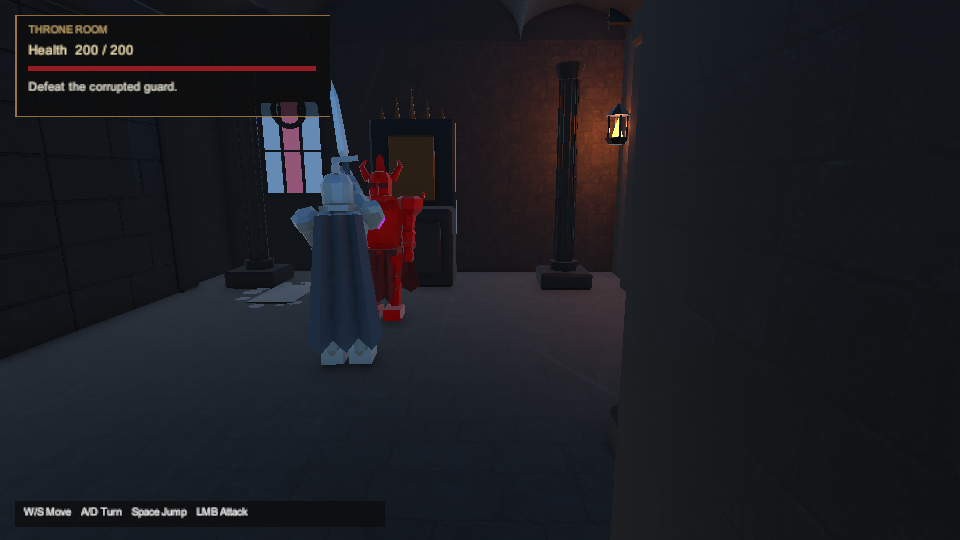
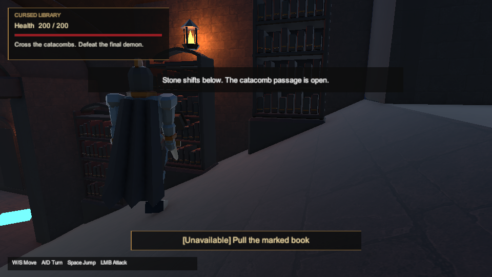
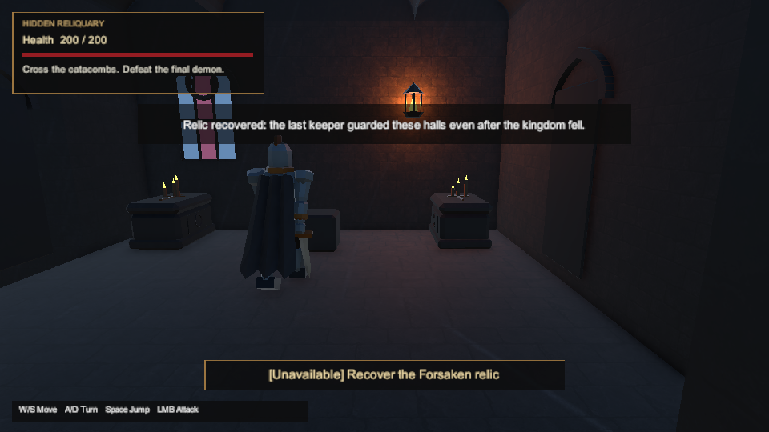
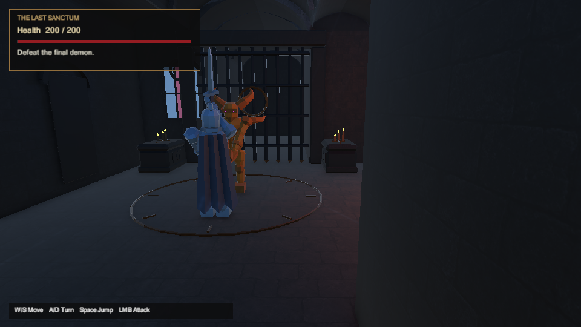
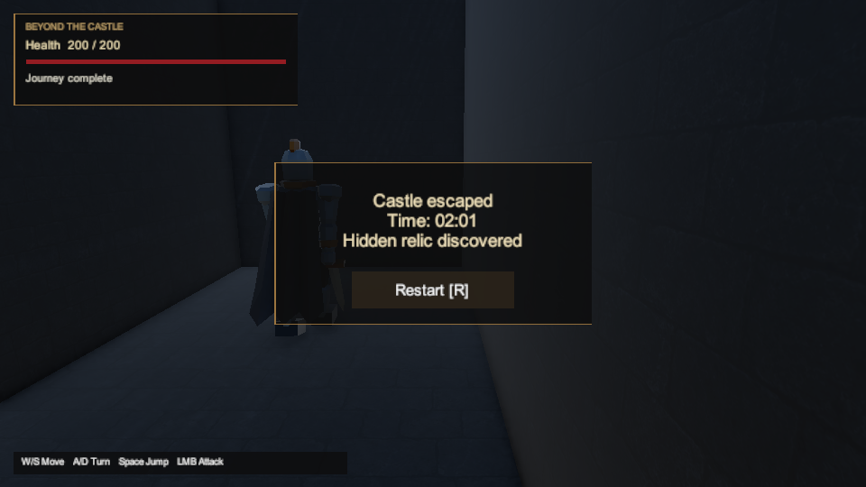
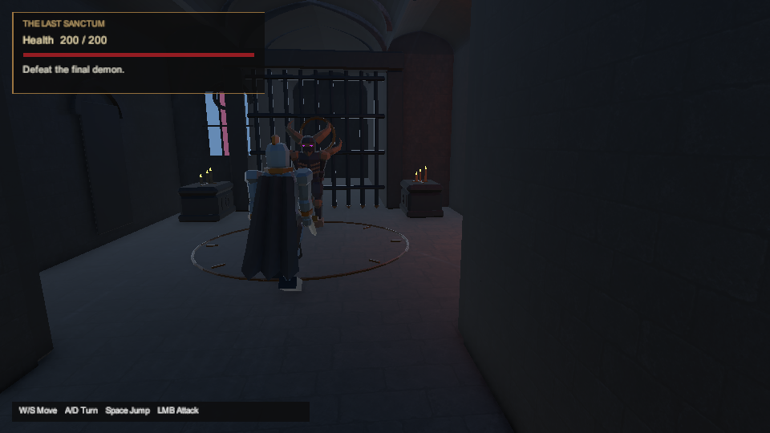

# Gothic presentation implementation — 2026-10-01

DOCX §§2, 4–5 guide this castle art pass; §§3, 6–8 govern the preserved route. The text, flow/map and four visual references were inspected separately. Unity **6000.6.3f1**, package pins and the original DOCX remain unchanged.

**Corrected materials passed authoring, 173 EditMode tests, 172 PlayMode tests and a Windows player build.** Import review found six intended emissive materials carrying `EmissiveIsBlack` (flag 4), which caused URP to remove `_EMISSION`. Both builders now fix the flag; the forced-reimport regression passed. The gallery below contains unchanged captures from passing PlayMode14. Build4 produced the presentation candidate; the separate clean-input build5 receipt below follows it. Neither candidate has been launched.

## Implemented behavior

The author saves original gothic architecture, props, articulated actors and two stone albedos. It includes mountain silhouettes, mist, vaults, stained windows, moon/torch lighting, an opaque library bookcase gate and concealed stone secret doors. Actor movement/attack/death visuals observe existing gameplay. The HUD shows health, room, objectives, interactions and terminal outcomes. [Art provenance](../art-provenance.md) records source authorship and texture prompts.

Presentation leaves the recorded collider configuration, transforms, parenting, layers and activation unchanged before navigation baking. Gate/mechanism renderers follow existing progression/reset state. Structural boxes retain square joins to prevent floor/wall gaps; saved-visible-triangle ray tests supplement the unchanged collision checks. The opt-in observer records bounded frame/hardware/memory evidence without controlling gameplay; its rules and remaining requirements are in the [DOCX matrix](../docx-acceptance.md).

## Validation status

| Check | Recorded result and scope |
| --- | --- |
| Pure C# cores | **160 .NET passes**: 29 progression, 36 movement, 32 camera, 17 interactions, 46 combat. The editor-only emission correction does not change these core sources. |
| Python tooling | **84 passes after the emission correction**, retained in `artifacts/validation/presentation-python-emission.log`. |
| Corrected native authoring | Author17: **exit 0, 38.2 s; 106,220 environment triangles / 126 renderers / 126 mesh assets**, physics guard passed. |
| Corrected EditMode | EditMode5: **173/173 passed, 0 failed / skipped**, 1.5735556 s suite, 20.06 s runner, exit 0. The emission reimport regression passed in 0.517974 s. |
| Corrected PlayMode | PlayMode14: **172/172 passed, 0 failed / skipped**, suite 448.5385036 s. The original native CLI's **exit 0 was observed after wrapper recovery**; 475.39 s spans original start to observed native exit. All six full-route/death/gate cases, nine actor/performance cases and the scene-cleanup regression passed. |
| Presentation Windows build | Historical build4: **exit 0, 0 errors / 0 warnings**, 133,693,642 reported bytes; **63.56 s runner**, build duration `00:00:50.6014793`. `player-candidate-final/ShadowsOfTheForsaken.exe` is **unlaunched**. |

PlayMode14's known-route basic/secret runs took **81.591 s / 121.163 s**, both finishing with **200 HP**. These are automation timings, not first-time human pacing or acceptance of the DOCX's 2–3 minute basic-route target. Earlier timings and exact input traces remain retained.

The editor suites used **`-disableaudio` and a reused native cache**; they do not qualify audio or a clean checkout/cold cache. The [evidence JSON](gothic-presentation-2026-10-01/evidence.json) records run commands, source hashes, candidate files, asset review and retained failures. Author17's source archive is **18,124,449 bytes**, SHA-256 `86e7e1dd6cd7e6283babe2a9f4799f3ab895dcfb55d86b2f06880534593c885e`; earlier manifests/archives and raw results remain retained. Canonical import of the 359 generated paths changed only the six emissive materials and scene. The frozen build4 source contains 660 files; its 29-file delta from author17 is retained (37,131 bytes).

Final build4 review found **461 byte-identical files and 199 reviewed differences** against 659 branch files: 147 whitespace, 35 compatibility `_Color` round-trips, 13 URP material defaults and four profile/runtime/cache/template entries. All **63 C# files match exactly**. Review reused 192 exact native/branch hash pairs and freshly checked the scene plus six emissive materials. Those six preserve flag 2, matching nonzero emission colors and `_EMISSION` in both copies; no unresolved drift remains. The retained `native-build4-asset-review.json` has SHA-256 `27c57ef3260993c530db329af1f63b6557189f16365240503b2aea8def0070ba`.

The retained `author17-scene-semantic-review.json` compares all **3,456 serialized objects** against author12 through a bijection of hierarchy/component identities. It found **zero semantic differences** after mapping local IDs, and the branch scene matches author17. Only five local IDs stayed unchanged, explaining the large YAML diff. This serialized comparison does not replace runtime or visual validation.

## Clean-input Windows build

Build5 starts from a fresh export of **commit `8602b8e38f0f933c01efc00b0f42fd50bf71659a`**: all **659 Unity inputs** match the committed Git blobs before first import. Merged main `c50aba050ae0096e072cce151173eb14e5a90256` has the same project inputs. There was no project `Library`, `Temp`, local editor state or manual scene authoring. Only the installed pinned editor and package-download cache were reused. The existing `CastlePlayerBuild.BuildForBatch` built the committed castle scene; [reproduction commands and launch instructions](../unity-testing.md#build-windows-z-czystego-checkoutu) describe the procedure.

The native build finished with **exit 0, no stop condition, 0 errors / 0 warnings**, **854.16 s** total runner time and BuildReport duration **`00:08:05.7095047`**. Its **198 engine-produced files total 133,693,640 bytes** in `player-candidate-clean`, which remains **unlaunched**. A supplementary `BUILD-INFO.json` identifies the source commit, matching main, editor and original engine-file manifest; its bytes are recorded separately from Unity’s BuildReport total. The [separate clean-build receipt](clean-build-2026-10-01.json) binds the commit, input archive/copy receipts, command, logs, frozen source and every candidate file. The freeze has **659 files, 18 reviewed changed paths, no removals**, with a 33,709-byte delta. The independent audit verified every reconstructed source hash: 641 files remain exact, 13 legacy materials add only URP AssetVersion10 metadata, three URP settings retain reviewed import serialization and two project settings differ only in whitespace. It reports **zero unresolved findings**.

The cold import retains the committed disabled-shader-pass state on 13 legacy blockout materials, while the earlier warm import also serialized shader defaults and disabled `MOTIONVECTORS`. This bounded import-state difference does **not** establish cold-versus-warm rendered parity; gameplay C#, scene, navigation and authored emission values remain unchanged.

The **173 EditMode5 / 172 PlayMode14** passes above are earlier suites on the same **63 C# files**, not new suites executed in the clean project. Build5 establishes a build without an existing project cache; it does not establish standalone gameplay, audio, performance, human readability or pacing. The historical presentation evidence JSON remains unchanged.

## Rendered evidence

**Corrected PlayMode14 gallery.** These nine unchanged **960×540 PNGs total 3,845,230 bytes** and come from its passing secret-route case. [Gallery provenance](gothic-presentation-2026-10-01/gallery.json) records hashes, source case, execution and XML. The scene-camera capture sets its destination before clearance/UI layout, observes ordinary windup frames and restores temporary settings. Current and historical raw originals remain retained.

The images show the cyan rune, lit flames/eyes, HUD objectives and repaired vault/floor joins. No missing-shader magenta or reopened structural seam was visible in this review. Close combat framing still partly obscures enemies behind the player; these captures do not establish human readability, standalone or final art acceptance.

| Courtyard | First fight | Rune lever |
| --- | --- | --- |
|  |  |  |
| **Throne fight** | **Library** | **Optional relic** |
|  |  |  |
| **Final fight** | **Secret-route completion** | **Final arena seam check** |
|  |  |  |

## Retained failures and corrections

| Attempt / finding | Exact result and disposition |
| --- | --- |
| Author9 | `CS0619` rejected obsolete `SceneHandle` → integer conversion. Helper/regression now compare `Scene` identity; editor/package pins unchanged. |
| PlayMode11 | **149/171 passed, 22 failed, 0 skipped**. Loads included 86 s and 127 s. Setup asserted before owning late loads, leaving duplicate navigation/listeners and blocked-gate failures. The shared scene owner now drains/unloads owned loads, restores globals in `finally` and prevents new loads while cleanup is incomplete. |
| PlayMode12 | **171/172 passed, 1 failed, 0 skipped**. `EveryPassageIsWalkableInBothDirections("Courtyard", "FirstEncounter", true)` failed setup at **32.515 s**; Unity load **32.505 s** exceeded the unchanged **30 s** threshold. No threshold was enlarged to pass. |
| Material import audit | Six nonzero-emission materials lost `_EMISSION` because of `EmissiveIsBlack`; semantic rendering mismatch. Corrected authoring, forced-reimport regression, PlayMode/capture review and build4 passed. |
| Author13 | **Exit 6, 33.11 s**: interrupted task-local `Library` cleanup left `PackageCache` source files missing. Infrastructure failure, **no valid project-source compilation verdict**. Cleanup stopped after 67,892,187 logical bytes removed; remaining cache/diagnostics preserved. Pinned-cache repair precedes author14. |
| Author14 | **Exit 6, 73.97 s**: restored package definitions were omitted by stale source discovery upstream of Bee. Four source/hash checks are retained in `source-discovery-diagnostic.json`; generated source-index files were moved recoverably. |
| Author15 | **Exit 1, timeout after 1,891.17 s**; no authoring result or C# errors. **Post-stop diagnostics recorded 10 failed ILPP nodes** with gRPC request aborts; whether stopping caused those failures is not established. Progress NDJSON and summary are retained. |
| Author16 | **Natural exit 6, 526.77 s**: `WriteResponseFile` for `Library/Bee/artifacts/rsp/9675442845102135732.rsp` reported permission denied; diagnostics also record an ILPP PDB sharing failure. Later inspection found no persistent ACL/lock cause. All 81 postprocessed DLLs and `TundraBuildState.state` persisted; no authoring result. |
| PlayMode14 wrapper | WSL wrapper ended with **exit 143, cause unknown**, while the original Windows CLI/editor continued. A retained observer attached to that CLI through `OpenProcess` / `GetExitCodeProcess`; no test was restarted. It observed **native CLI exit 0**, and XML records 172/172 passes. The wrapper itself did not exit successfully. |

Other corrected findings were inactive old mechanism visuals, a 33-character meta GUID (replaced with a valid 32-character GUID), overlapping amber combat cues, a stale throne objective, open vault ends and bevel seams. Saved-scene/component tests and retained captures record their checks. Raw XML, logs, source manifests, failed inputs and unique captures are preserved. Earlier build3 remains historical and unlaunched.

## Deferred acceptance

The prior player reached the first fight and rune puzzle at full health, then lost foreground focus before the throne. A second launch could not acquire focus and sent no gameplay input. Both exited normally with incomplete evidence retained. The owner selected **“Continue implementation; test later.”** No new standalone candidate has been launched.

Standalone basic/secret/death/restart checks, hardware-specific performance qualification, human first-time play and the 2–3 minute basic-route target remain unverified. Rendered editor captures and automation do not establish those outcomes. CI Unity activation separately requires configured GitHub secrets.
