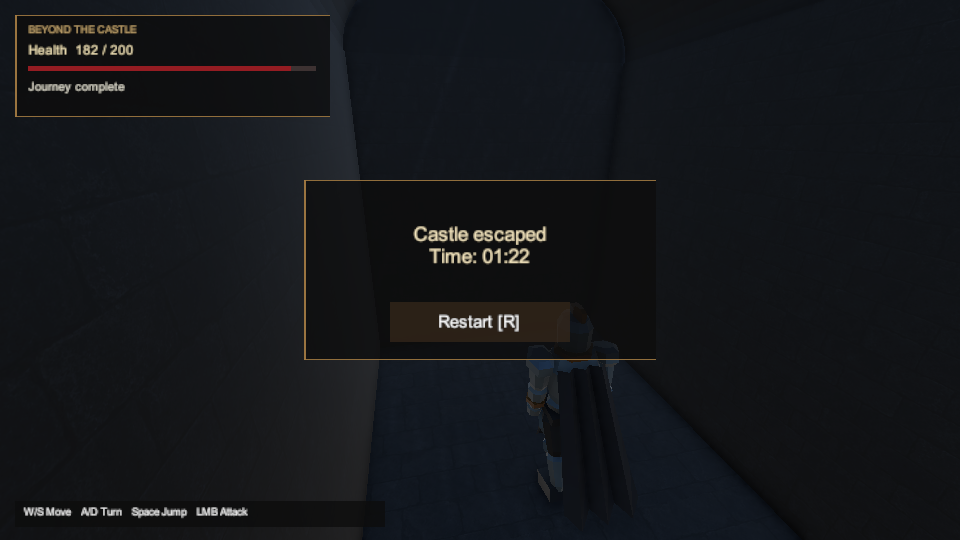
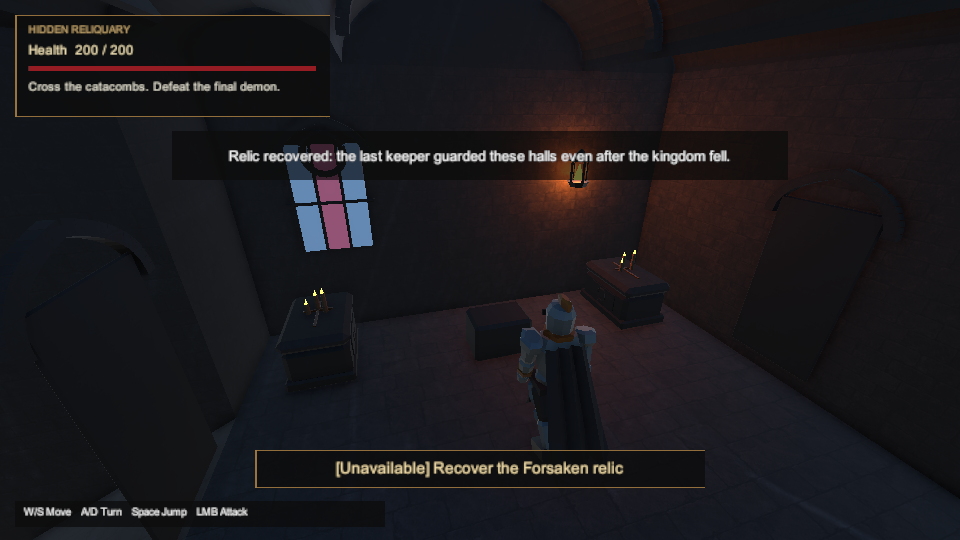
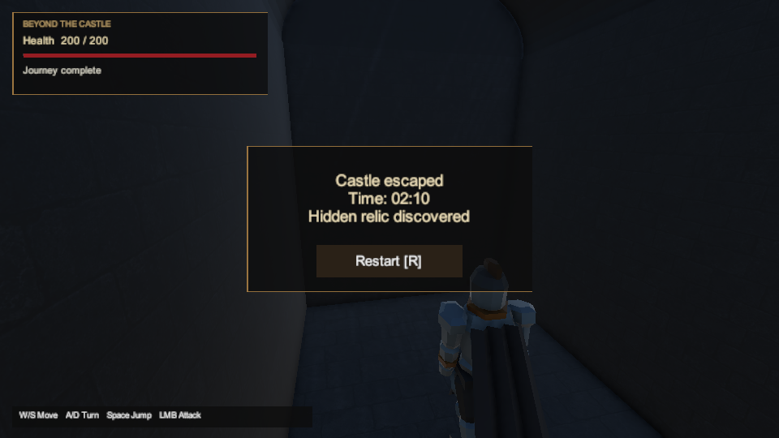

# Room observation validation — 2026-10-01

The [room performance observer](../room-performance.md) passed **173 EditMode and 202 PlayMode tests** in pinned Windows Unity **6000.6.3f1**. All **15 performance fixture cases**, including the eight new cases, passed. The Windows build completed with zero errors and warnings; all 198 engine files and the build receipt are verified. Standalone testing remains deferred by the owner.

This supports implementation of #21/#24: room visits retain their own session identity, frame histogram, warmup, exclusions and observed configuration. It validates the instrumentation; it does not supply standalone room benchmarks, individual-light/GPU cost, human pacing or final DOCX acceptance.

## Results and scope

| Check | Result |
| --- | --- |
| Python tooling | **142 passed**, 20.817 s; complete fixture-qualified 173/202 catalog and negative cases for omitted/mislabelled room tests. |
| Source / design | Source integrity and contract passed; DOCX unchanged; 29 basic / 63 optional-route reachable model states. |
| Pure C# | Earlier **7/7 Performance and 29/29 Progression** passes reused after exact comparison of all 10 compilation/project/contract input files and retained TRX hashes. No local rerun is claimed. The new Performance CI jobs also passed. |
| EditMode10 | **173/173**, zero failed/skipped, exit 0; 153.25 s runner / 3.0085722 s NUnit suite. |
| PlayMode43 | **200/202**, two failed, zero skipped, exit 8; 524.06 s runner / 434.774694 s suite. Both failures were scene-load deadlines; all 15 performance cases passed. Retained separately below. |
| PlayMode44 | Unchanged full retry: **202/202**, zero failed/skipped, exit 0; 619.03 s runner / 540.658514 s suite. |
| Windows build7 | Succeeded, zero errors/warnings, exit 0; 158.17 s runner / 90.5031540 s Unity build. Engine-reported output: 133,699,472 bytes. Verified 198 engine files and the separate BUILD-INFO receipt; player unlaunched. |

The tested source is commit `8cdba0197532e8e6fea5b711c30152b837d8e5d6`. It contains **661 committed Unity inputs**; the isolated native project contains **662 imported inputs** with the same **54 exact reviewed source/import differences** as the camera's post-build state. Only the two observer/test C# files and new accumulator/meta were synchronized. Each test run froze all 662 inputs unchanged, with a **64-path / 249,232-byte delta**. Existing camera/build results retain their original revision and scope.

The runner reused the native import cache, disabled audio, selected the complete test assemblies and used no test filter. Its bounded settings remain the agent-selected **32 GiB Windows reserve / 5 GiB task cap**, under the owner's instruction to continue despite disk usage. Only each run's own IL post-processing service was normalized from BelowNormal to Normal priority; no unrelated process or OS setting was changed.

The [completed evidence receipt](room-performance-2026-10-01/evidence.json) binds each execution, XML/log and frozen input archive. The [import review](room-performance-2026-10-01/import-review.json) accepts only the same 54 exact source/import hash pairs reviewed for build6. Build7 retained all 662 inputs unchanged. Its **198 engine files / 133,699,472 bytes** were independently inventoried and verified through the production build-identity tool. The additional **259,675-byte `BUILD-INFO.json`** has trusted SHA-256 `ffa73a1761e5899b20dd27986c7e0661343cdf18dd44440e7234fd5d6ed158ac` and identifies commit `8cdba0197532e8e6fea5b711c30152b837d8e5d6`. It is supplementary to the engine file count. The player is retained locally at `artifacts/full-route-unity/player-room-performance-7` in the original Windows checkout and remains unlaunched.

## Earlier failure and retry

PlayMode43's `CastleLockedMainGatesRejectWalkingAndJumping` and `CastleSecretRouteReturnsThroughThroneAndStillRequiresFinalFight` stopped at the unchanged **30-second scene-load deadline**, before traversal. Unity logged **32.2064 s** and **31.704621 s** total load times, almost entirely deserialization. The [failure record](room-performance-2026-10-01/earlier-failure.json) retains exact XML/log/source hashes; raw failure diagnostics and captures remain local.

No accumulating scene/capture leak was identified by code review: owned loads await unloading, capture textures are released, and mesh sampling uses temporary managed arrays. This is not proof of a cause. A [single Windows resource snapshot](room-performance-2026-10-01/retry-context.json) was taken around retry startup, not during the failures; it does not establish resource causality.

PlayMode44 used the same source, runner, assertions and deadline and passed both cases within its complete 202-case suite. Its 26 castle loads ranged from **0.299017 to 18.872227 seconds**. No timeout or visibility threshold was relaxed. The earlier failures remain recorded, and their exact cause remains unproven.

## Actual game captures

These are unedited game-camera PNGs from automated PlayMode44 routes, bound to the frozen inputs in the [capture manifest](room-performance-2026-10-01/captures.json). The displayed session times are known-route automation times, not human pacing measurements. The observer is opt-in; the ordinary route fixtures do not collect standalone performance data.

The compact [source-check record](room-performance-2026-10-01/source-checks.json) and [.NET input comparison](room-performance-2026-10-01/dotnet-input-reuse.json) preserve the distinction between tooling, pure C#, Unity tests and the pending standalone acceptance.
