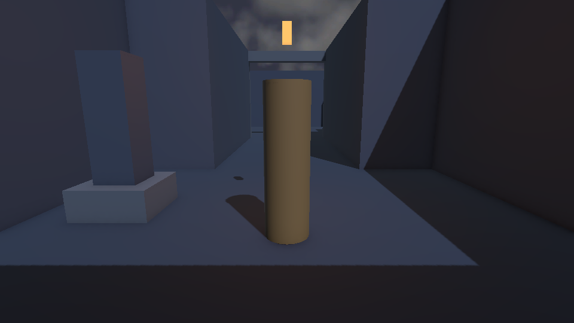
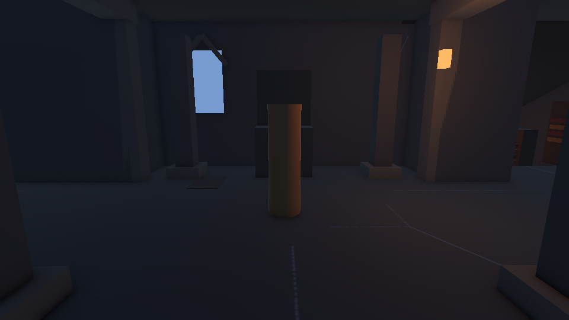
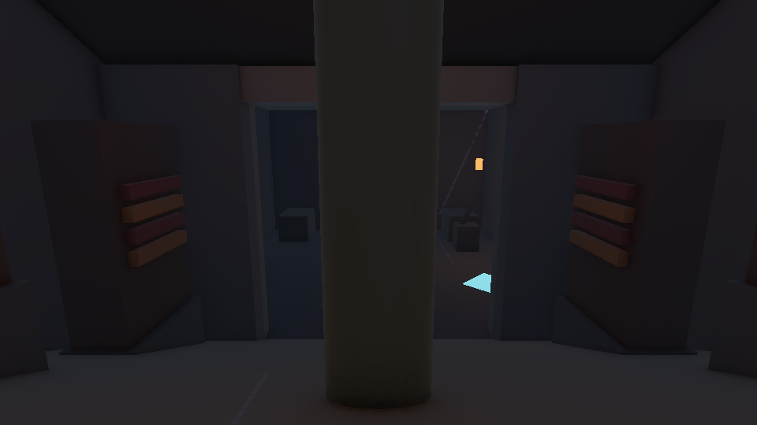
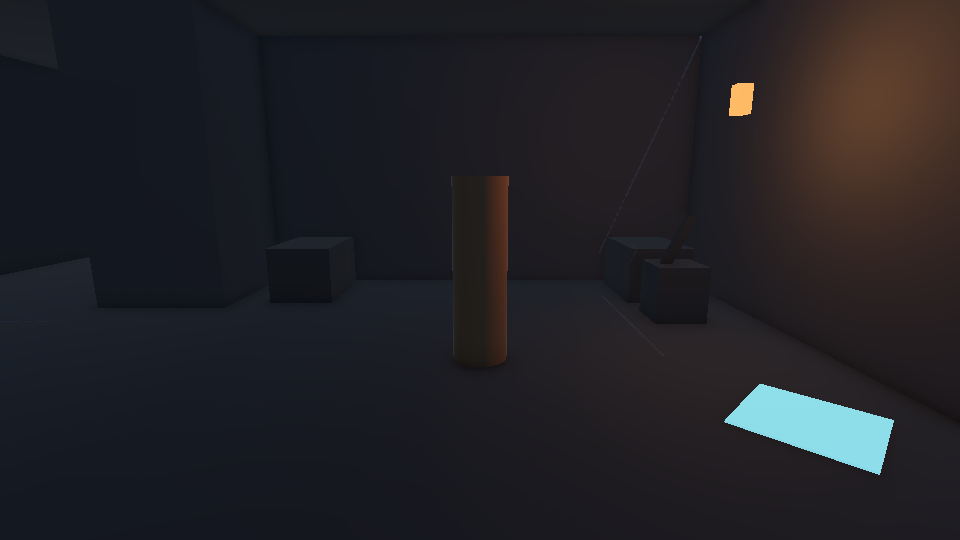
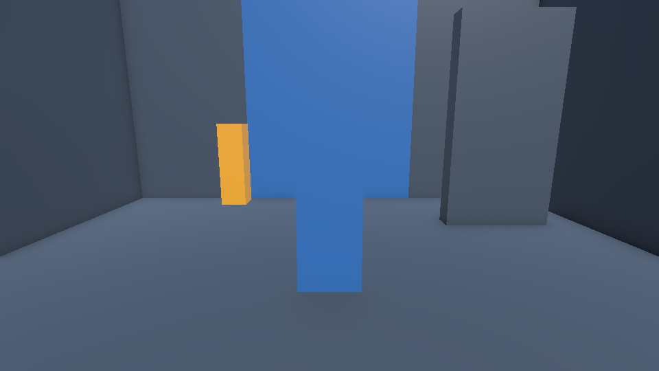
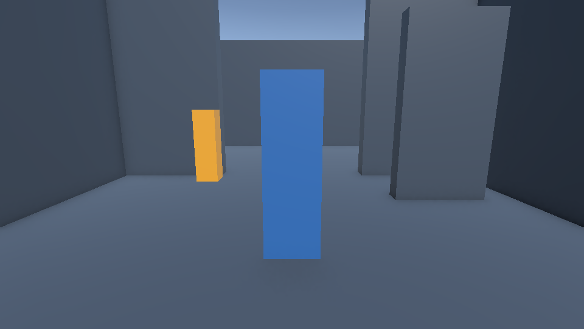
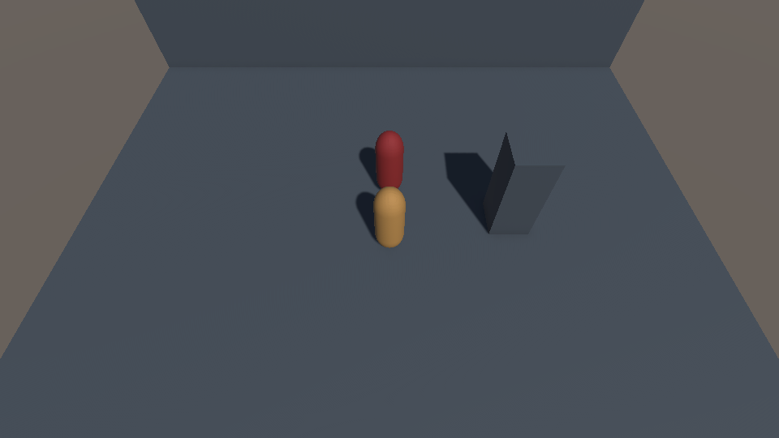
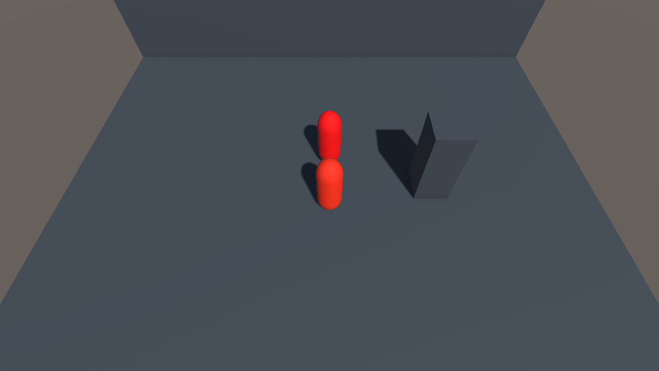
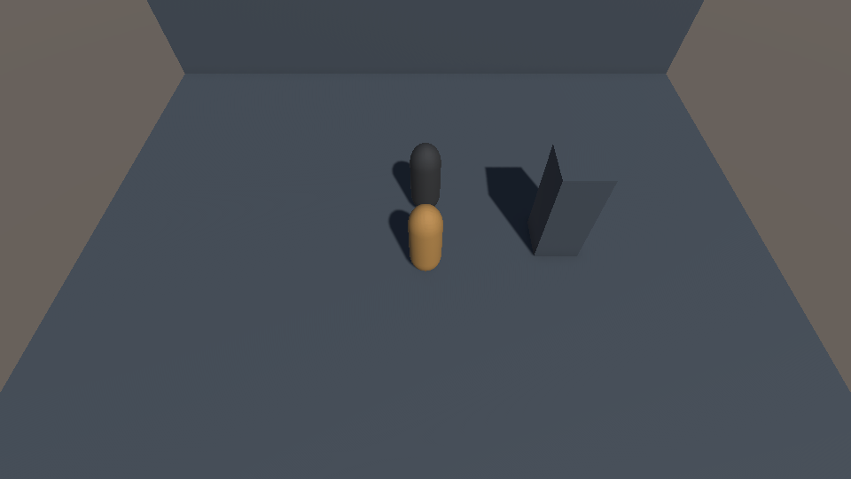

# Shared interactions and combat: local validation, 2026-09-30

Implements the shared mechanics requested by issues #9 and #11: DOCX §3–4 and §6–8 for interactions/gates, and §1, §3 and §6 for combat. The two saved demo scenes are technical fixtures. Castle layout from PR #31 is now on main and is included after rebase; the new mechanics remain in independent demo scenes. Encounter AI, concrete puzzles, full-level reset and completion remain separate issues.

## Environment and results

The initial mechanics-only suites passed 148 EditMode and 89 PlayMode cases. The final combined suite includes the castle scene regressions after rebase.

Windows Unity **6000.6.3f1 (45d8eee7de74)**, D3D11, using the installed local license and Unity Hub CLI. Editor and package pins are unchanged. Development started at main `13e1691ee127b116291d9057387a0196bf06698f`; before delivery the branch was rebased onto `832eea856ff562e6a95e47f362a9063eab7aaf74`, which includes the merged castle layout. A separate native Windows clone was used; the owner's dirty checkout was not changed. Test input hashes and raw-result hashes are recorded in the companion JSON manifest. Scripts, scenes, metadata, packages and editor/build pins match the tested inputs. Unity reserialized 20 materials on import: original and imported hashes are recorded separately, with the original clean-import manifest and full import patch retained. These generated serialization changes were not copied into the branch; authored shader, base/emission color and surface settings were checked unchanged.

| Validation | Result | What it establishes |
| --- | --- | --- |
| Python tooling | 82 passed | Contract, documentation links, source and result validator regressions |
| Level contract | Passed, 29/63 reachable states without/with the secret | The original DOCX and progression contract are unchanged |
| .NET 8.0.318 | 145 passed: progression 29, movement 36, camera 32, interactions 17, combat 31 | Real shared C# cores, separately from MonoBehaviour |
| Unity EditMode | 153 passed, zero failed/skipped | Baseline 6, castle 5 and shared cores: progression 26, movement 36, camera 32, interactions 17, combat 31 |
| Unity PlayMode | 109 passed, zero failed/skipped | Baseline 2, castle traversal 20, progression 7, movement 17, camera 22, interaction physics/input 15, combat physics/input 24, saved demos 2 |
| Saved scene authoring | Both builders exited 0 in the pinned editor | Native Unity scene serialization, GUID/material references |
| Rendering | Ten scene-camera frames inspected | Four castle rooms, gate visibility and placeholder combat states; not an ordinary-controls playthrough |

The NUnit validator requires the new named regressions and parameterized counts. Empty, skipped or partially executed results do not pass. The separate C# workflow also rejects incomplete TRX reports. Unity CI activation is separate from this local license; its result must be checked on the PR.

## Reproduction and evidence

Open `Assets/Interactions/Demo/InteractionDemo.unity` or `Assets/Combat/Demo/CombatDemo.unity`. Their explicit authoring commands are `InteractionDemoBuilder.BuildForBatch` and `CombatDemoBuilder.BuildForBatch`; neither runs on import or changes Build Settings. See [interaction wiring](../interactions.md) and [combat wiring](../combat.md).

Run the documented Python checks and the five .NET suites from README. The local engine commands were:

```powershell
unity.exe test <isolated-project> --mode EditMode --editor-path <6000.6.3f1/Editor/Unity.exe> --timeout 1800 --output <editmode-results.xml> --non-interactive --no-log-proxy -- -assemblyNames Shadows.EditMode.Tests -logFile <editmode.log>
unity.exe test <isolated-project> --mode PlayMode --editor-path <6000.6.3f1/Editor/Unity.exe> --timeout 900 --output <playmode-results.xml> --non-interactive --no-log-proxy -- -assemblyNames Shadows.PlayMode.Tests -logFile <playmode.log>
```

`SHADOWS_CAPTURE_DIR` optionally enables ten 960×540 PNGs during the saved-demo and castle-traversal PlayMode cases; use a graphics-capable editor. Captures render the actual saved scene camera with synchronous shader compilation; other additive scenes' geometry, lights and post-processing volumes are temporarily excluded and restored. The castle frames come from the existing traversal waypoints, without a separate showcase camera. Synthetic keyboard/mouse input goes through the existing PlayerMovement signals; real CharacterController/physics checks verify traversal and hit behavior. The camera capture does not include the IMGUI HUD and does not prove human control, prompt readability, audio or final art acceptance.

Raw local evidence is retained under `artifacts/shared-gameplay-unity` in the original checkout, including each attempt's XML/logs, commands, working-source hashes, input patches, builder records and unmodified captures. The authoring worktree retains TRX reports and commands under `artifacts/validation`. The manifest ties retained reports and captures to their hashes; generated caches are excluded from Git.

## Failures found and corrected

The initial cold import exposed obsolete `GetInstanceID` calls under the pinned editor. Unity-facing identity now uses full `EntityId`, with deterministic ranking and generic core hit tracking; there is no truncation or hash-based identity.

A saved-scene test then exposed native MaterialPropertyBlock allocation in a MonoBehaviour field initializer. Allocation now occurs in OnEnable. The occupied-gate regression was making thirty movements within one Unity frame; it still verifies immediate safe deferral on reset, verifies that the full capsule has escaped, and then requires collider/visual closure within three real physics ticks. No production gate rule or failure expectation was disabled.

One repeated run began before source synchronization finished. Its recorded old source hashes identify it as a superseded failed run, not evidence for the fixes. All such reports remain available. First-use shader placeholder frames were likewise retained; final capture waits for synchronous shader compilation. Render review also led to a higher saved combat-demo camera so the player does not conceal the target's hit/death feedback.

Final passing runs reuse the imported cache. The corrected source has successful import/compilation and full suites, but this report does not claim a fresh cold-cache pass of the final source.

## Rendered frames

These are unchanged PNGs from the final PlayMode run, not generated concept art. [Manifest](shared-gameplay-2026-09-30/manifest.json) records source and evidence hashes.

| Castle courtyard | Throne room |
| --- | --- |
|  |  |

| Library | Catacombs |
| --- | --- |
|  |  |

| Closed gate | Open gate |
| --- | --- |
|  |  |

| Ready | Windup | Hit | Death |
| --- | --- | --- | --- |
|  |  |  |  |

The castle remains a blockout. Review found strong player-body occlusion in the library camera view; this inherited camera limitation remains open. An earlier courtyard frame displayed a magenta torch, while the warmed repeat renders the unchanged material orange. The early frame is retained: first-use shader timing is suspected, not established. Passing traversal and component tests do not certify castle presentation. Demo hit/death colors are visible with the adjusted saved camera.

## Remaining acceptance

No player build, human keyboard/mouse playthrough, HUD review or timed 2–3 minute level traversal was performed. These scenes do not implement the complete castle or prove its progression. Local engine success does not configure GitHub's Unity activation; failing or skipped CI must not be bypassed. The issues remain open for review and any remaining acceptance work.

## Cleanup record

After the runs became inactive, removed only the task clone's `artifacts/unity-acceptance/checkout/Library`: **1,175,664,461 logical bytes**, 28,715 files, after ownership, reparse-point, stability and process checks. The separate authoring worktree's `artifacts/nuget`, `artifacts/dotnet-home` and the five suites' `bin`/`obj` plus `Core/bin`/`Core/obj` were likewise checked and removed: **118,347,823 logical bytes**, 1,075 files. Original assets, user work, Git metadata, tools and global caches were preserved.

Raw failures and passes, commands, source patches, hashes, all unique captures and the native clone's small diagnostics remain. `cleanup.json` and `artifacts/validation/linux-cleanup.json` record exact allowlists and measurements. Windows free space immediately after its cleanup was **96,546,021,376 bytes (89.92 GiB)**; the observed increase was 1,211,998,208 bytes and may include concurrent activity. Linux free space at final inspection was **835,678,388,224 bytes (778.29 GiB)**. Deleted Linux files free space inside WSL; no WSL VHDX compaction or host allocation reclamation is claimed.
